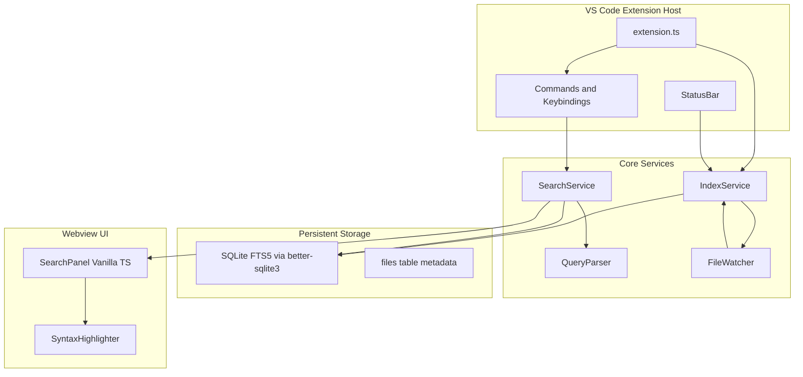
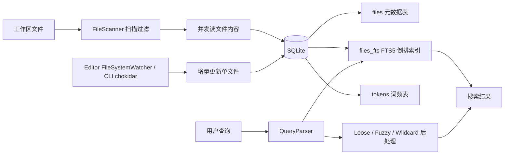

## Development

### Windows

```bat
install.bat   REM 安装依赖（含 better-sqlite3 原生编译）
build.bat     REM 编译、测试并打包 .vsix
```

### macOS / Linux

```bash
chmod +x install.sh build.sh install-extension.sh bump-version.sh
./install.sh
./build.sh
./install-extension.sh
```

Version bump (same as `bump-version.bat`):

```bash
./bump-version.sh 0.2.1 --notes "Fix Electron ABI 146 native packaging."
```

### 手动命令

```bash
npm install
npm run build
npm run rebuild:node   # CLI / MCP need system Node ABI for better-sqlite3
# Press F5 in VS Code with launch.json
```

### MCP (AI Agent)

Read-only stdio MCP server over existing Ace Code Search SQLite indexes:

```bash
npm run build
npm run rebuild:node
npm run mcp -- --db /path/to/index.db
# strict registry plus an explicit client workspace scope
npm run mcp -- --registry /path/to/registry.json --workspace-root /path/to/workspace
# tolerant auto-discovery of VS Code/Cursor globalStorage registries
npm run mcp
# opt in only when cross-workspace access is intentional
npm run mcp -- --all-indexes
```

Tools: `list_indexes`, `search_code`, `read_indexed_file`, `find_header_source`.
Results come from the **index snapshot**, not a live filesystem walk. Automatic discovery tolerates broken registries/databases and reports them through `list_indexes.warnings`; explicit `--db` and `--registry` sources remain strict. A missing legacy build-state marker is `unknown`, and every state other than `complete` returns `partialIndex: true`.

Default discovery is scoped to MCP client workspace roots, then explicit repeated `--workspace-root` arguments, then cwd. Every mapped index output root must be contained by a client root, so a parent index or mixed unrelated roots fail closed. Direct `--db` explicitly authorizes that database; `--all-indexes` explicitly opts into cross-workspace registry access. When multiple indexes remain visible, tools require `indexId`.

Codex/Cursor launchers and direct CLI/MCP runs use the system-Node binaries under `native-node/`. The VS Code MCP definition provider launches `process.execPath` with `ELECTRON_RUN_AS_NODE=1`, so a local Electron extension host selects the matching `native/` ABI; remote system-Node extension hosts select `native-node/`. Both paths resolve the installed extension root before loading `better-sqlite3`.

Workspace Primary/Secondary selection, `workspaceIndexBindingV2`, shared-index creation, and `<index.db>.writer.lock` are intentionally excluded from MCP: they mutate editor state or writer ownership. MCP still discovers per-editor registries (including shared/manual DB paths after an IDE registers them), supports explicit `--db`, opens databases read-only, and never acquires the writer lease.

#### Agent integration installation

The search toolbar document-check button (command **Ace Code Search: Install Agent Integration (Project Guidance + User MCP)**) installs:

- Canonical full Skill: `{workspace}/.agents/skills/ace-code-search-mcp/SKILL.md`
- Thin Cursor routing Rule: `{workspace}/.cursor/rules/ace-code-search-first.mdc`
- Thin Claude compatibility wrapper: `{workspace}/.claude/skills/ace-code-search-mcp/SKILL.md`
- Stable user launcher: `~/.ace-code-search/mcp-launcher.cjs`
- User MCP configs: `~/.codex/config.toml` and `~/.cursor/mcp.json`
- A dynamic VS Code MCP provider (`ace-code-search.mcp-servers`) when that API is available

The launcher discovers the newest installed Ace Code Search extension each time it starts, so client config does not retain a versioned extension path. Skill files alone do not expose MCP tools; after installation, restart Codex or run `/mcp`.

Codex/Cursor launcher configs invoke `node` from the client PATH; the published VSIX guarantees native bindings for Node.js 20, 22, and 24. VS Code's dynamic provider uses the editor runtime, so it does not depend on a separate PATH Node.

The full Skill exists only in `.agents`; do not recreate a `.cursor/skills` mirror. Normal installation does not create project `.codex/config.toml` or `.github/instructions`, and activation does not write anything. **Ace Code Search: Install Optional VS Code Copilot Search Instruction** is the explicit opt-in for the project `.github/instructions` wrapper. The personal Cursor User Rule copy helper remains optional.

Managed files use owner/kind/content-hash markers and atomic replacement. TOML blocks and recognized legacy Cursor JSON entries migrate only when their exact managed shape is known. Invalid markers, malformed configs, custom entries, and user-modified files are preserved with warnings. A legacy project `.codex` block, `.cursor/skills` mirror, or default `.github/instructions` file is removed only when its managed content can be verified.

The packaged Skill source `resources/skills/ace-code-search-mcp/SKILL.md` must stay byte-identical to `.agents/skills/ace-code-search-mcp/SKILL.md`. Packaged Cursor Rule `resources/rules/ace-code-search-first.mdc` must stay byte-identical to `.cursor/rules/ace-code-search-first.mdc`; it is a thin route to the canonical Skill.

#### Prefer-indexed-search guidance

- Project Cursor Rule and Claude wrapper: installed by the toolbar command above.
- Project VS Code Copilot Instruction: installed only by its explicit optional command.
- Optional Cursor personal User Rule text: `resources/rules/cursor-user-rule.txt` via **Copy Cursor User Rule (Personal)**.

The guidance prefers indexed MCP tools for code discovery, but requires `rg`/filesystem/direct-read fallback when no matching index exists, `partialIndex` affects completeness, content may be stale, or files are excluded/unindexed. It never treats indexed snapshots as unsaved content.

`vscode:prepublish` only runs the normal `npm run build` (esbuild). Cross-platform Electron and Node native binaries are produced by the rebuild scripts and Release GitHub Actions workflow, not by `vscode:prepublish`. `npm run test:native` builds the runtime entries and runs the native matrix/VSIX/CLI smoke tests.

## Release

推送 `v*` 标签后，GitHub Actions 会自动完成跨平台原生模块编译、打包 `.vsix`、创建 GitHub Release，并发布到 VS Code Marketplace。

### 一次性准备

下面是从 0 开始配置 VS Code Marketplace 发布权限的 SOP。只需要做一次；之后发版由 GitHub Actions 读取 `VSCE_PAT` 自动发布。

#### 0. 准备账号与权限

1. 使用同一个 Microsoft 账号登录：
   - Visual Studio Marketplace: <https://marketplace.visualstudio.com/manage>
   - Azure DevOps: <https://dev.azure.com/>
2. 如果浏览器里同时登录了多个 Microsoft/Azure 账号，建议用无痕窗口重新登录，避免 Marketplace 和 Azure DevOps 使用不同身份。
3. PAT 属于创建它的用户账号。后续该账号必须对目标 Marketplace Publisher 有发布权限，否则 token 本身正确也会发布失败。
4. 注意：VS Code 官方文档提示 Azure DevOps global PAT 会在 2026-12-01 退役；当前仍按 PAT 配置，后续需要迁移到 Microsoft Entra ID/托管身份发布方案。

#### 1. 创建 Azure DevOps 组织（如果还没有）

1. 打开 <https://dev.azure.com/>。
2. 如果提示创建组织，按向导创建一个 Azure DevOps Organization。
3. Organization 名称不需要和 Marketplace Publisher ID 一样；PAT 只需要能访问 Marketplace scope。
4. 创建完成后进入组织首页，地址通常是：

```text
https://dev.azure.com/<Your_Organization>
```

#### 2. 创建 PAT

1. 进入 Azure DevOps 组织首页后，优先直接打开 PAT 页面：

```text
https://dev.azure.com/<Your_Organization>/_usersSettings/tokens
```

2. 也可以从页面右上角进入：在蓝色顶栏点击 **User settings** 用户设置图标（通常是“人像 + 齿轮/设置”的图标，在问号帮助图标右侧、账号名或圆形头像左侧），然后选择 **Personal access tokens**。
3. 注意不要点击最右侧圆形头像或账号名弹层；那个菜单通常只显示 Microsoft 账号、切换目录、切换账号和注销。如果只看到这些选项，说明点到的是账号菜单，关闭弹层后改点它左侧的 **User settings** 图标，或者直接使用上面的 URL。
4. 点击 **+ New Token**。
5. 按以下字段填写：
   - **Name**: `ace-code-search-marketplace-publish`。
   - **Organization**: 选 **All accessible organizations**。
   - **Expiration**: 建议 90 天、180 天或团队约定的轮换周期；不要选无期限。
   - **Scopes**: 只勾选 **Marketplace → Manage**。
6. 如果看不到 Marketplace scope：
   - 点击 scope 面板底部的 **Show all scopes**。
   - 确认当前账号已进入 Marketplace Publishing Portal，并且拥有 Publisher 权限。
   - 如果公司 Azure DevOps 有 PAT policy，联系组织管理员允许创建对应 scope 的 PAT。
7. 点击 **Create**。
8. 立即复制生成的 token。PAT 只显示一次，关闭页面后无法再次查看。

#### 3. 创建或确认 Marketplace Publisher

1. 打开 [Visual Studio Marketplace Publishing Portal](https://marketplace.visualstudio.com/manage)。
2. 使用创建 PAT 的同一个 Microsoft 账号登录。
3. 如果还没有 Publisher，点击 **+ Create a publisher**。
4. 填写 Publisher 信息：
   - **ID**: 发布用的 Publisher ID；创建后不能修改。它必须和 `package.json` 的 `publisher` 完全一致。
   - **Name**: 面向用户显示的名称。
5. 本项目当前配置为：

```json
"publisher": "OscarKing888"
```

6. 如果 Portal 里实际 Publisher ID 不同，优先修改 `package.json`，并确认 Marketplace 上没有同名冲突。
7. 本地可用 `vsce login` 验证 PAT 和 Publisher 是否匹配：

```bash
npx vsce login OscarKing888
```

8. 粘贴 PAT 后，如果提示 token verification succeeded，说明 Publisher 与 PAT 权限匹配。

#### 4. 写入 GitHub Actions Secret

1. 打开 GitHub 仓库页面。
2. 进入 **Settings → Secrets and variables → Actions**。
3. 点击 **New repository secret**。
4. 填写：
   - **Name**: `VSCE_PAT`
   - **Secret**: 粘贴刚创建的 PAT
5. 保存后不要把 PAT 写入代码、日志、Issue、PR 或本地文档。

#### 5. 验证发布权限

1. 在 GitHub 打开 **Actions → Release → Run workflow**。
2. 首次验证可以取消 Marketplace 发布选项，只确认 VSIX 能正常打包。
3. 确认无误后再次运行并启用 Marketplace 发布，或推送版本 tag 触发自动发布。
4. 如果 workflow 日志出现 `VSCE_PAT not set`，说明 GitHub Secret 名称不对、未保存到当前仓库，或 workflow 运行环境没有读取到该 secret。
5. 如果 Marketplace 发布报 401/403：
   - 确认 PAT 没过期。
   - 确认 PAT scope 是 **Marketplace → Manage**。
   - 确认 `package.json` 的 `publisher` 等于 Marketplace Publisher ID。
   - 确认创建 PAT 的 Microsoft 账号对该 Publisher 有发布权限。

参考：

- Azure DevOps PAT 创建文档：<https://learn.microsoft.com/en-us/azure/devops/organizations/accounts/use-personal-access-tokens-to-authenticate>
- Marketplace Publisher 创建与发布概览：<https://learn.microsoft.com/en-us/azure/devops/extend/publish/overview>
- VS Code 扩展发布文档：<https://code.visualstudio.com/api/working-with-extensions/publishing-extension>
- 命令行发布与 PAT 说明：<https://learn.microsoft.com/en-us/azure/devops/extend/publish/command-line>

### 发版步骤

```bash
# 1. 更新 package.json 中的 version
# 2. 更新 CHANGELOG.md
git add package.json CHANGELOG.md
git commit -m "chore: bump version to 0.1.8"
git tag v0.1.8
git push origin main --tags
```

标签版本须与 `package.json` 的 `version` 一致（如 tag `v0.1.8` 对应 version `0.1.8`）。

也可在 GitHub **Actions → Release → Run workflow** 手动触发；可勾选是否发布到 Marketplace（仍需配置 `VSCE_PAT`）。

## Configuration

See VS Code Settings → **Ace Code Search** for exclude globs, context lines, phrase search default, fuzzy default, loose gap, and more.

## Phase 3 — Multi-Index & Tabs

- **Multi-tab results**: `Ctrl+Enter` new tab, lock tabs with 🔒, close with ×
- **Shared Primary**: new non-autocreate workspaces use one deterministic DB path shared by VS Code and Cursor; `Ace Code Search: Choose Workspace Primary Index...` also supports an auto-discovered candidate or manually selected `index.db`
- **Secondary indexes**: `Ace Code Search: Open Secondary Index` opens a discovered or manually selected DB read-only by default; writable mode requires known source roots and the writer lease
- **Index management**: toolbar ⚙ or `Ace Code Search: Manage Indexes` opens a dedicated editor tab with a compact workspace context, a dominant Primary, subordinate Secondary rows, a lower-priority Available list, and one selected-index inspector. The inspector separates **Index content** (read-only roots, inherited/global rules, Additional exclusions) from **This workspace** (role, access/writer state, directory mappings). Native dialogs own DB/root selection; the UI must not render fake root editing or access-mode controls that the backend cannot commit.
- **Autocreate**: add `code-search.autocreate` in workspace root (optional JSON config)
- **Directory mapping**: map `\\server\share => C:\local` for shared indexes
- **CLI**: `npm run cli -- create|update|list` (see [PHASE2.md](PHASE2.md))
- **MCP**: `npm run mcp` — read-only stdio tools for AI agents (see Development → MCP above)

### Cross-IDE Primary binding and compatibility

Startup precedence is: `code-search.autocreate` → a valid `workspaceIndexBindingV2.<workspace-hash>` Primary → matching legacy/current registry entry → the pre-shared default `{globalStorage}/code-search/<workspace-hash>/index.db` → deterministic shared path → create/choose prompt. Probing the old deterministic path preserves existing indexes even if an older `registry.json` was lost or reset. A missing, corrupt, or incompatible saved/legacy database is logged and skipped so the next distinct candidate can still open; the same failed physical path is not retried through duplicate registry metadata. If no replacement is selected, the unresolved saved Primary binding is preserved for a later retry instead of being erased. `code-search.autocreate` remains authoritative and intentionally fails startup when its configured index cannot open.

Bindings are separated by workspace hash inside editor `workspaceState` and store paths rather than registry IDs, because VS Code and Cursor maintain separate registries. The old `secondaryIndexIds` value is still written for downgrade compatibility, but it is imported only once into V2 state; afterward a keyed binding (including an empty Secondary list) is authoritative so changing workspace roots cannot inherit another root set's Secondary indexes. A keyed Secondary that is temporarily missing, invalid, or unavailable remains in the binding across routine saves and shutdown, so a later startup can retry it; only an explicit **Close** or **Forget** removes that path. Writable Secondary restore opens, registers, and persists the service first, then scans in the background, so a large Secondary cannot block the management/search UI during extension activation. Interactive **Open Secondary** uses the same non-blocking behavior; explicit standalone index creation retains its progress-wait flow.

Default shared paths:

| Platform | Path |
| --- | --- |
| Windows | `%LOCALAPPDATA%\AceCodeSearch\indexes\<workspace-key>\index.db` |
| macOS | `~/Library/Application Support/AceCodeSearch/indexes/<workspace-key>/index.db` |
| Linux | `${XDG_DATA_HOME:-~/.local/share}/AceCodeSearch/indexes/<workspace-key>/index.db` |

`workspace-key` is a SHA-256 prefix over the sorted canonical workspace roots, so root ordering and Windows path casing do not split VS Code and Cursor onto different shared databases. The existing 32-bit workspace hash remains the editor initialization identity and continues to name legacy/autocreate paths, registry associations, and workspace binding entries.

Existing `globalStorage/.../code-search/<hash>/index.db` files remain in place and reopen as `legacy`; no automatic copy or deletion occurs. Candidate discovery reads both VS Code and Cursor registries, accepts exact normalized root matches or a legacy workspace-hash match, deduplicates by physical DB path, and ignores a temporarily unreadable peer registry.

Requested access modes are `readOnly` and `auto`. `auto` writes and fsyncs the owner JSON to a same-directory temporary file, then atomically publishes `<index.db>.writer.lock` with a no-replace hard link; the winner opens writable, while a contender waits briefly for first-use schema creation, then opens the same SQLite DB read-only and reports the writer label. Filesystems without hard-link support fall back to exclusive create, but a malformed/incomplete main lock is then deliberately never auto-reclaimed: close every IDE using that index before manually removing it. Read-only services use `fileMustExist` and SQLite `query_only`, validate the required schema, and never create/migrate tables, scan roots, or start a watcher. Writer locks are released only by their token owner, and a valid dead main-lock owner is reclaimed behind a second atomic-create guard. An existing `<index.db>.writer.lock.reclaim` is likewise intentionally fail-safe and is never auto-deleted because filesystem check-then-unlink cannot atomically prove that another process did not replace it; if a process dies during that very small recovery window, close every IDE using the index before manually deleting the orphan guard. When the writer exits normally, or leaves only the valid main lock, an idle automatic reader periodically acquires ownership, reopens writable, and starts indexing/watching without a reload.

Primary replacement is validated before the old Primary closes. Promoting an attached Secondary removes the duplicate service, and the active Primary path cannot also be attached as a Secondary. A writable DB with unknown roots requires explicit source-root selection. Live DB moves are rejected; only inactive catalog entries are eligible in the manager. Physical delete holds the registry writer lease from the final merged-reference check through unlink. Move validates its merged destination and commits or rolls its catalog path back while holding that same lease; after a successful `COPYFILE_EXCL`, an ambiguous failed commit leaves the destination copy for manual recovery instead of deleting a path a peer may have claimed.

Command-palette Primary/Secondary/create flows capture the current manager plus workspace identity before opening native pickers. If workspace folders change while a picker or database open is pending, the old result may still be reported but cannot update the new workspace binding, Primary source, or search service.

### Cross-IDE verification

```bash
npx ts-node test/sharedIndexStorage.test.ts
npx ts-node test/workspaceIndexBinding.test.ts
npx ts-node test/workspaceOperationGuard.test.ts
npx ts-node test/indexWriterLease.test.ts
npx ts-node test/indexDiscovery.test.ts
npx ts-node test/indexRegistry.test.ts
npx ts-node test/indexPresence.test.ts
npx ts-node test/startupPrimarySelection.test.ts
npx ts-node test/indexManager.test.ts
npx ts-node test/indexServiceDispose.test.ts
npx ts-node test/indexServiceRecovery.test.ts
npm test
npx tsc --noEmit
npm run build
```

Manual smoke test: open the same workspace in VS Code and Cursor, select the shared Primary in both, and confirm one shows writable while the other names that writer and remains read-only. Then verify manual Primary selection survives reload, Secondary attachments restore, missing/non-Ace DBs fail without replacing the working Primary, and an autocreate workspace disables panel Primary changes.

## Roadmap

See [PHASE2.md](PHASE2.md) — Phase 2 & 3 complete.

---

## 架构与实现

### 架构概览



**技术选型**

- **语言**: TypeScript + VS Code Extension API
- **索引引擎**: `better-sqlite3` + SQLite FTS5（持久化，BM25 排序，适合百万级命中）
- **文件监视**: VS Code/Cursor 原生 `FileSystemWatcher`；CLI/non-editor 使用 `chokidar` fallback
- **模糊搜索**: 编辑距离 + FTS5 后处理（`FuzzyMatch.ts`）
- **UI**: WebviewView + Vanilla TS 前端
- **语法高亮**: `vscode-textmate` + 当前主题 token 颜色
- **构建**: `esbuild` 打包 extension + webview

**索引存储位置**: 新工作区默认使用上文的 IDE-independent `AceCodeSearch/indexes/<workspace-key>/index.db`；`context.globalStorageUri/code-search/` 保留 registry 与 legacy DB 兼容。`code-search.autocreate` 可继续用 `indexLocation` 指定路径。

### 项目结构

```
.
├── package.json
├── tsconfig.json
├── esbuild.js
├── ess.bat / ess.sh          # CLI 入口脚本
├── src/
│   ├── extension.ts          # 激活、注册命令、生命周期
│   ├── cli/index.ts          # 独立 CLI（create / update / list）
│   ├── mcp/                  # 只读 stdio MCP（list/search/read/header-source）
│   │   ├── server.ts
│   │   ├── session.ts
│   │   ├── tools.ts
│   │   └── discover.ts
│   ├── index/
│   │   ├── IndexService.ts   # 建索引、增量更新、状态管理
│   │   ├── IndexManager.ts   # 多索引注册与管理
│   │   ├── IndexWriterLease.ts # 单写者锁、死进程回收
│   │   ├── sharedIndexStorage.ts # 跨 IDE 共享路径与 canonical path
│   │   ├── workspaceIndexBinding.ts # workspace Primary/Secondary 路径绑定
│   │   ├── indexDiscovery.ts # 合并 VS Code/Cursor registry 候选
│   │   ├── FileScanner.ts    # 遍历、过滤二进制/排除规则
│   │   ├── FileWatcher.ts    # 编辑器原生监听 + chokidar fallback
│   │   ├── Autocreate.ts     # code-search.autocreate 解析
│   │   └── schema.sql        # FTS5 表结构
│   ├── native/
│   │   └── betterSqlite3.ts  # native 模块加载与 Electron ABI 解析
│   ├── search/
│   │   ├── QueryParser.ts    # 解析 ext:/dir:/age:/loose: 等
│   │   ├── SearchService.ts  # FTS5 MATCH + 后处理
│   │   ├── MultiIndexSearchService.ts
│   │   ├── WildcardMatcher.ts
│   │   ├── LooseSearch.ts
│   │   └── FuzzyMatch.ts
│   ├── ui/
│   │   ├── SearchPanelProvider.ts
│   │   ├── IndexManagePanel.ts
│   │   ├── webview/main.ts
│   │   └── manage-webview/main.ts
│   └── utils/
│       └── syntaxHighlight.ts
└── media/
```

### 数据库 Schema（核心）

```sql
-- 文件元数据
CREATE TABLE files (
  id INTEGER PRIMARY KEY,
  path TEXT UNIQUE NOT NULL,
  mtime INTEGER NOT NULL,
  size INTEGER NOT NULL,
  ext TEXT,
  dir TEXT,
  content TEXT NOT NULL DEFAULT ''
);

-- FTS5 全文索引
CREATE VIRTUAL TABLE files_fts USING fts5(
  path UNINDEXED,
  content,
  tokenize='unicode61 remove_diacritics 0'
);

-- 词频表（自动补全）
CREATE TABLE tokens (
  token TEXT PRIMARY KEY,
  freq INTEGER DEFAULT 1
);
```

索引流程：扫描文件 → 读文本 → INSERT/UPDATE `files` + 同步 `files_fts` → 提取 token 更新 `tokens`。

### 搜索查询语法

解析用户输入为结构化对象：

```
输入: myVar ext:cpp dir:utils -file:ChangeLog age:2h
输出: { terms: ["myVar"], filters: { ext: ["cpp"], dir: ["utils"], fileExclude: ["ChangeLog"], ageMax: "2h" } }
```

- **FTS5 查询**: 单词/短语直接转 FTS5 MATCH 语法
- **通配符**: 单词级 `*` 转 FTS5 prefix query（`token*`）；行内/跨行通配符由 `WildcardMatcher` 后处理
- **age 过滤**: SQL `WHERE mtime > ?` 与 FTS 结果 JOIN
- **ext/dir/file 过滤**: 对 `files` 表路径匹配（glob）
- **仅过滤**: 无搜索词时直接 SELECT files 表

### 搜索面板 UI

```
┌─────────────────────────────────────────────────────────────┐
│ [搜索框: myVar ext:cpp]  [Aa] [""]  [⟳]  [⚙]              │
│  Case  Phrase  Refresh  Settings                            │
├─────────────────────────────────────────────────────────────┤
│ 1,234 hits in 56 files · 0.08s          Indexing: 42% ████░ │
├─────────────────────────────────────────────────────────────┤
│ ▼ src/utils/parser.ts:42                                    │
│   const myVar = parse(input);   // 语法高亮行                │
│ ▼ src/core/handler.ts:108                                   │
│   return myVar.toString();                                    │
└─────────────────────────────────────────────────────────────┘
```

- 停靠位置：Panel 底部区域（`viewsContainers` + `views`）
- 消息协议：`search` / `openFile` / `indexStatus` / `updateSettings`

### 命令与快捷键

| 命令 | 默认快捷键 | 说明 |
|------|-----------|------|
| `codeSearch.searchSelection` | `Alt+=` | 搜索光标下单词/选中文本 |
| `codeSearch.focusSearch` | `Shift+Alt+=` | 聚焦搜索框 |
| `codeSearch.quickOpenFile` | `Shift+Alt+F` | 文件过滤模式 |
| `codeSearch.nextHit` | `Ctrl+Alt+]` | 下一命中（面板内聚焦时） |
| `codeSearch.prevHit` | `Ctrl+Alt+[` | 上一命中（面板内聚焦时） |
| `codeSearch.switchHeaderSource` | `Alt+O` | 在索引中查找并切换头/源文件（C/C++ 扩展名） |
| `codeSearch.refreshIndex` | — | 强制重建索引 |
| `codeSearch.manageIndexes` | — | 打开 Workspace Primary / Secondary 管理页 |
| `codeSearch.selectPrimaryIndex` | — | 选择共享、自动发现或手动 `index.db` 作为 Primary |
| `codeSearch.openSecondaryIndex` | — | 打开只读或自动单写者 Secondary |
| `codeSearch.createIndex` | — | 创建并打开一个可写 Secondary |
| `codeSearch.openClassHierarchy` | — | 直接打开全部已索引 C++ class 的继承树 panel |

### 配置项

- `codeSearch.excludeGlobs` — 全局排除模式；除常见 `node_modules`, `dist`, `bin`, `obj` 外，默认还覆盖 Unreal 的 `Binaries`, `DerivedDataCache`, `Intermediate`, `Saved` 等生成目录
- `codeSearch.includeGlobs` — 包含模式（默认 `**/*`）
- `codeSearch.contextLines` — 开启 Ctx 后每条命中上下各显示的行数（默认 1，范围 0–10）
- `codeSearch.phraseSearchDefault` — 默认短语模式
- `codeSearch.autoOpenSingleHit` — 唯一命中自动打开
- `codeSearch.maxResults` — 最大结果数（默认 10000）
- `codeSearch.indexOnStartup` — 打开工作区时自动索引

### 关键实现细节

**1. 二进制检测**: 读取文件头最多 8KB，检测 null 字节或不可打印字符比例 > 30%，或 UTF-8 替换字符过多，则跳过该文件。

**2. 索引性能**: 批量事务（每 100 文件 commit 一次）；`IndexService` 在搜索/用户输入时暂停扫描（`pauseIndexing()`）。

**3. 跨 IDE 索引所有权**: `IndexManager` 保存 requested/effective access；`IndexWriterLease` 决定唯一 writer，竞争方创建 read-only `IndexService`，并在原 writer 退出后于空闲时自动接管。Primary 切换先打开并持久化新服务再关闭旧服务；异步 dispose 会等待 lease 释放，`IndexService` generation 会终止旧扫描，防止切换后继续写库。物理删除在管理 lease 下拒绝重复 catalog 路径，并在 registry writer lease 内完成最终引用检查、提交与清理；兼容性的 DB move 是“不覆盖的 copy/repoint”（保留源文件），同时持有源/目标 lease，在同一 registry lease 内提交或回滚路径，拒绝 live WAL 与任何已有目标。

**4. Class 继承缓存**: `ClassHierarchyCacheManager` 仅在索引和搜索空闲时读取待更新源码，最多两个 Worker 只负责解析，完成后由扩展线程集中、分批提交 `class_hierarchy_*` 缓存表，并在批次间重新检查搜索/索引状态。只读或无缓存的旧 secondary index 不执行 schema 写入，打开继承树时改用一次内存解析。

**5. 语法高亮**: Webview 通过 `postMessage` 获取当前 `colorTheme`，用 `vscode-textmate` 对结果行 tokenize，映射到 CSS class。

**6. native 模块**: `better-sqlite3` 需分别针对 VS Code/Cursor 内置 Electron ABI 与系统 Node ABI 预编译。Electron 产物放在 `native/<platform>-<arch>-<abi>/`；Node 20/22/24 发布矩阵放在 `native-node/<platform>-<arch>-<abi>/`，本地 `scripts/rebuild-node.js` 仍支持当前任意 Node 20+ ABI。发布工作流按平台/ABI 分开构建、合并并验证 24 个必需条目。`vscode:prepublish` **只**跑普通 esbuild，不负责 native；使用 `npm run test:native` 做本机 native/VSIX/CLI 回归。

**7. 与 VS Code 内置搜索的关系**: 本插件是**补充**而非替代——提供预索引全文搜索体验；不修改内置 Search 面板。

## 索引与搜索算法

本扩展采用 **SQLite FTS5 倒排全文索引**，不是向量/语义搜索，也不是自研搜索引擎。整体可概括为：预建索引 + FTS5 检索 + 自定义过滤与后处理。

### 数据流概览



### 索引阶段（建库）

实现位于 `src/index/IndexService.ts`、`FileScanner.ts`、`FileWatcher.ts`。

**存储结构**（见 `src/index/schema.sql`）：

| 表 | 作用 |
|----|------|
| `files` | 路径、mtime、大小、扩展名、目录、完整文件内容 |
| `files_fts` | FTS5 虚拟表，对 `content` 建倒排索引 |
| `tokens` | 词频统计，供搜索框自动补全 |

FTS5 分词器（实际代码）：

```sql
tokenize='unicode61 remove_diacritics 0'
```

即 SQLite 内置 **unicode61** 按 Unicode 规则切词，不做 Porter 英文词干化。

**扫描与过滤**（`FileScanner.ts`）：

1. 递归遍历工作区（栈式 DFS）
2. 按 `excludeGlobs`、目录名、文件大小等排除
3. 扩展名白名单 + 二进制检测：
   - 已知二进制扩展名直接跳过
   - 读取文件头最多 8KB：null 字节 >30%、不可打印字符 >30%、UTF-8 替换字符过多 → 视为二进制
4. 文本文件整文件读入，写入数据库

**写入流程**（`IndexService.ts`）：

1. **全量/增量**：对比 `mtime`，未变化文件跳过
2. **批量事务**：每 100 个文件 commit 一次
3. 每个文件：`INSERT/UPDATE files` → 更新 `files_fts`（先删后插）→ 用正则 `/[a-zA-Z_][a-zA-Z0-9_]*/g` 提取标识符写入 `tokens`（每文件最多 500 个，长度 ≥2）
4. **并发读盘**：可配置 `codeSearch.indexThreads`；搜索时 `pause()` 索引以降低 IO 争抢
5. **增量更新**：`chokidar` 监视文件增删改，单文件重索引

数据库使用 WAL 模式（`journal_mode = WAL`），默认路径见上文「索引存储位置」。

### 搜索阶段（查询）

实现位于 `src/search/SearchService.ts`、`QueryParser.ts`。

**标准搜索：FTS5 + BM25**

1. `QueryParser` 解析查询词及 `ext:` / `dir:` / `file:` / `age:` 等过滤
2. 将搜索词转为 FTS5 `MATCH` 语法（支持 `*` 前缀通配）
3. 执行 `files_fts MATCH ?` 并与 `files` 表 JOIN
4. FTS5 默认以 **BM25** 排序相关性
5. 再按路径、扩展名、mtime、`+/-` 内容过滤等做 SQL 或内存过滤

**高级模式**（FTS 之外的补充算法）：

| 模式 | 做法 |
|------|------|
| **Loose 松散短语** | FTS 先筛候选文件，再用 token 间距算法在内存中找词距 ≤ N 的命中（`LooseSearch.ts`） |
| **Fuzzy 模糊** | FTS 结果不足时，对候选内容做编辑距离匹配（`FuzzyMatch.ts`） |
| **行内/跨行通配符** | FTS 粗筛 + `WildcardMatcher` 在内容上做模式匹配 |
| **仅过滤** | 无搜索词时直接查 `files` 表，按路径/扩展名过滤 |

### 与 VS Code 内置搜索的对比

| | Ace Code Search | VS Code 内置搜索 |
|--|-----------------|------------------|
| 方式 | 预先索引（后台建库） | 实时 ripgrep 扫盘 |
| 引擎 | SQLite FTS5 倒排索引 | ripgrep 正则 |
| 大仓库 | 索引完成后查询通常更快 | 每次搜索扫文件 |
| 存储 | 本地 `.db` 占磁盘 | 无持久索引 |

### 一句话总结

> 文件扫描过滤 → 全文存入 SQLite → **FTS5 unicode61 倒排索引（BM25 排序）** → 查询时 FTS MATCH + 元数据过滤 → 必要时 Loose / Fuzzy / Wildcard 内存后处理。

### 风险与缓解

| 风险 | 缓解 |
|------|------|
| `better-sqlite3` 原生编译在不同 VS Code 版本失败 | 预编译 binary + GitHub Actions 多平台构建；文档说明 Node 版本 |
| 超大仓库首次索引耗时长 | 边索引边搜索 + 进度条 + 可配置排除 |
| FTS5 不支持全部复杂通配符语义 | 复杂通配符走 SQL 过滤 + 内存后匹配 |
| F8 / Shift+Alt+方向键 与内置快捷键冲突 | 默认 `Ctrl+Alt+]` / `Ctrl+Alt+[`；仅面板 webview 聚焦时生效；可自定义 |
| `Alt+O` 与其它扩展头/源切换冲突 | 扩展默认解绑旧命令；启动时自动迁移用户 `keybindings.json` 中的 Alt+O 旧绑定，并持续劫持 `C_Cpp.SwitchHeaderSource` / `clangd.switchheadersource` |

### 参考

- [SQLite FTS5](https://www.sqlite.org/fts5.html)
