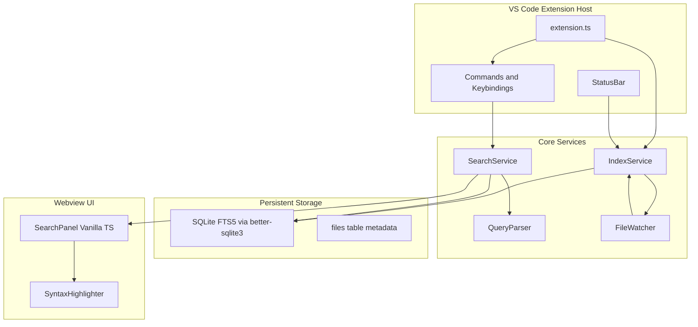

## Development

### Windows

```bat
install.bat   REM 安装依赖（含 better-sqlite3 原生编译）
build.bat     REM 编译、测试并打包 .vsix
```

### macOS / Linux

```bash
chmod +x install.sh build.sh
./install.sh
./build.sh
```

### 手动命令

```bash
npm install
npm run build
# Press F5 in VS Code with launch.json
```

## Release

推送 `v*` 标签后，GitHub Actions 会自动完成跨平台原生模块编译、打包 `.vsix`、创建 GitHub Release，并发布到 VS Code Marketplace。

### 一次性准备

1. 在 [Marketplace 管理页](https://marketplace.visualstudio.com/manage) 创建 Publisher，确保 `package.json` 中的 `publisher` 字段与之匹配。
2. 在 Azure DevOps 创建 PAT（Organization 选 **All accessible organizations**，Scope：**Marketplace → Manage**）。
3. 在 GitHub 仓库 **Settings → Secrets and variables → Actions** 中添加 `VSCE_PAT`。

### 发版步骤

```bash
# 1. 更新 package.json 中的 version
# 2. 更新 CHANGELOG.md
git add package.json CHANGELOG.md
git commit -m "chore: bump version to 0.1.8"
git tag v0.1.8
git push origin main --tags
```

标签版本须与 `package.json` 的 `version` 一致（如 tag `v0.1.8` 对应 version `0.1.8`）。

也可在 GitHub **Actions → Release → Run workflow** 手动触发；可勾选是否发布到 Marketplace（仍需配置 `VSCE_PAT`）。

## Configuration

See VS Code Settings → **Ace Code Search** for exclude globs, context lines, phrase search default, fuzzy default, loose gap, and more.

## Phase 3 — Multi-Index & Tabs

- **Multi-tab results**: `Ctrl+Enter` new tab, lock tabs with 🔒, close with ×
- **Secondary indexes**: `Ace Code Search: Open Secondary Index` — search third-party libs
- **Index management**: toolbar ⚙ or `Ace Code Search: Manage Indexes` — opens a dedicated **Manage Indexes** editor tab (WebviewPanel) with index cards, filter, inline rename, directory mappings, attach/detach, delete, and refresh. Create / attach / move still use native VS Code file dialogs.
- **Autocreate**: add `code-search.autocreate` in workspace root (optional JSON config)
- **Directory mapping**: map `\\server\share => C:\local` for shared indexes
- **CLI**: `npm run cli -- create|update|list` (see [PHASE2.md](PHASE2.md))

## Roadmap

See [PHASE2.md](PHASE2.md) — Phase 2 & 3 complete.

---

## 架构与实现

### 架构概览



**技术选型**

- **语言**: TypeScript + VS Code Extension API
- **索引引擎**: `better-sqlite3` + SQLite FTS5（持久化，BM25 排序，适合百万级命中）
- **文件监视**: `chokidar`（跨平台）
- **模糊搜索**: 编辑距离 + FTS5 后处理（`FuzzyMatch.ts`）
- **UI**: WebviewView + Vanilla TS 前端
- **语法高亮**: `vscode-textmate` + 当前主题 token 颜色
- **构建**: `esbuild` 打包 extension + webview

**索引存储位置**: `context.globalStorageUri/code-search/<workspace-hash>/index.db`（可通过 `code-search.autocreate` 自定义 `indexLocation`）

### 项目结构

```
.
├── package.json
├── tsconfig.json
├── esbuild.js
├── ess.bat / ess.sh          # CLI 入口脚本
├── src/
│   ├── extension.ts          # 激活、注册命令、生命周期
│   ├── cli/index.ts          # 独立 CLI（create / update / list）
│   ├── index/
│   │   ├── IndexService.ts   # 建索引、增量更新、状态管理
│   │   ├── IndexManager.ts   # 多索引注册与管理
│   │   ├── FileScanner.ts    # 遍历、过滤二进制/排除规则
│   │   ├── FileWatcher.ts    # chokidar 监听
│   │   ├── Autocreate.ts     # code-search.autocreate 解析
│   │   └── schema.sql        # FTS5 表结构
│   ├── search/
│   │   ├── QueryParser.ts    # 解析 ext:/dir:/age:/loose: 等
│   │   ├── SearchService.ts  # FTS5 MATCH + 后处理
│   │   ├── MultiIndexSearchService.ts
│   │   ├── WildcardMatcher.ts
│   │   ├── LooseSearch.ts
│   │   └── FuzzyMatch.ts
│   ├── ui/
│   │   ├── SearchPanelProvider.ts
│   │   ├── IndexManagePanel.ts
│   │   ├── webview/main.ts
│   │   └── manage-webview/main.ts
│   └── utils/
│       └── syntaxHighlight.ts
└── media/
```

### 数据库 Schema（核心）

```sql
-- 文件元数据
CREATE TABLE files (
  id INTEGER PRIMARY KEY,
  path TEXT UNIQUE NOT NULL,
  mtime INTEGER NOT NULL,
  size INTEGER NOT NULL,
  ext TEXT,
  dir TEXT
);

-- FTS5 全文索引（content 外部存储模式节省空间）
CREATE VIRTUAL TABLE files_fts USING fts5(
  path UNINDEXED,
  content,
  content='files',
  content_rowid='id',
  tokenize='porter unicode61'
);

-- 词频表（自动补全）
CREATE TABLE tokens (
  token TEXT PRIMARY KEY,
  freq INTEGER DEFAULT 1
);
```

索引流程：扫描文件 → 读文本 → INSERT/UPDATE `files` + 同步 `files_fts` → 提取 token 更新 `tokens`。

### 搜索查询语法

解析用户输入为结构化对象：

```
输入: myVar ext:cpp dir:utils -file:ChangeLog age:2h
输出: { terms: ["myVar"], filters: { ext: ["cpp"], dir: ["utils"], fileExclude: ["ChangeLog"], ageMax: "2h" } }
```

- **FTS5 查询**: 单词/短语直接转 FTS5 MATCH 语法
- **通配符**: 单词级 `*` 转 FTS5 prefix query（`token*`）；行内/跨行通配符由 `WildcardMatcher` 后处理
- **age 过滤**: SQL `WHERE mtime > ?` 与 FTS 结果 JOIN
- **ext/dir/file 过滤**: 对 `files` 表路径匹配（glob）
- **仅过滤**: 无搜索词时直接 SELECT files 表

### 搜索面板 UI

```
┌─────────────────────────────────────────────────────────────┐
│ [搜索框: myVar ext:cpp]  [Aa] [""]  [⟳]  [⚙]              │
│  Case  Phrase  Refresh  Settings                            │
├─────────────────────────────────────────────────────────────┤
│ 1,234 hits in 56 files · 0.08s          Indexing: 42% ████░ │
├─────────────────────────────────────────────────────────────┤
│ ▼ src/utils/parser.ts:42                                    │
│   const myVar = parse(input);   // 语法高亮行                │
│ ▼ src/core/handler.ts:108                                   │
│   return myVar.toString();                                    │
└─────────────────────────────────────────────────────────────┘
```

- 停靠位置：Panel 底部区域（`viewsContainers` + `views`）
- 消息协议：`search` / `openFile` / `indexStatus` / `updateSettings`

### 命令与快捷键

| 命令 | 默认快捷键 | 说明 |
|------|-----------|------|
| `codeSearch.searchSelection` | `Alt+=` | 搜索光标下单词/选中文本 |
| `codeSearch.focusSearch` | `Shift+Alt+=` | 聚焦搜索框 |
| `codeSearch.quickOpenFile` | `Shift+Alt+F` | 文件过滤模式 |
| `codeSearch.nextHit` | `Ctrl+Alt+]` | 下一命中（面板内聚焦时） |
| `codeSearch.prevHit` | `Ctrl+Alt+[` | 上一命中（面板内聚焦时） |
| `codeSearch.refreshIndex` | — | 强制重建索引 |

### 配置项

- `codeSearch.excludeGlobs` — 额外排除模式（默认含 `node_modules`, `dist`, `bin`, `obj`）
- `codeSearch.includeGlobs` — 包含模式（默认 `**/*`）
- `codeSearch.contextLines` — 开启 Ctx 后每条命中上下各显示的行数（默认 1，范围 0–10）
- `codeSearch.phraseSearchDefault` — 默认短语模式
- `codeSearch.autoOpenSingleHit` — 唯一命中自动打开
- `codeSearch.maxResults` — 最大结果数（默认 10000）
- `codeSearch.indexOnStartup` — 打开工作区时自动索引

### 关键实现细节

**1. 二进制检测**: 读取文件头 512 字节，检测 null 字节比例 > 30% 则跳过，自动排除二进制文件。

**2. 索引性能**: 批量事务（每 100 文件 commit 一次）；`IndexService` 在搜索/用户输入时暂停扫描（`pauseIndexing()`）。

**3. 语法高亮**: Webview 通过 `postMessage` 获取当前 `colorTheme`，用 `vscode-textmate` 对结果行 tokenize，映射到 CSS class。

**4. native 模块**: `better-sqlite3` 需针对 VS Code 内置 Node 版本预编译；在 `package.json` 的 `vscode:prepublish` 与 GitHub Actions 中处理跨平台 binary。

**5. 与 VS Code 内置搜索的关系**: 本插件是**补充**而非替代——提供预索引全文搜索体验；不修改内置 Search 面板。

### 风险与缓解

| 风险 | 缓解 |
|------|------|
| `better-sqlite3` 原生编译在不同 VS Code 版本失败 | 预编译 binary + GitHub Actions 多平台构建；文档说明 Node 版本 |
| 超大仓库首次索引耗时长 | 边索引边搜索 + 进度条 + 可配置排除 |
| FTS5 不支持全部复杂通配符语义 | 复杂通配符走 SQL 过滤 + 内存后匹配 |
| F8 / Shift+Alt+方向键 与内置快捷键冲突 | 默认 `Ctrl+Alt+]` / `Ctrl+Alt+[`；仅面板 webview 聚焦时生效；可自定义 |

### 参考

- [SQLite FTS5](https://www.sqlite.org/fts5.html)
