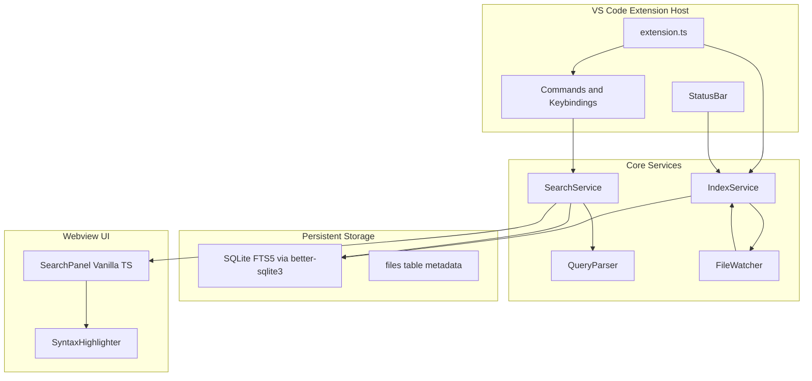
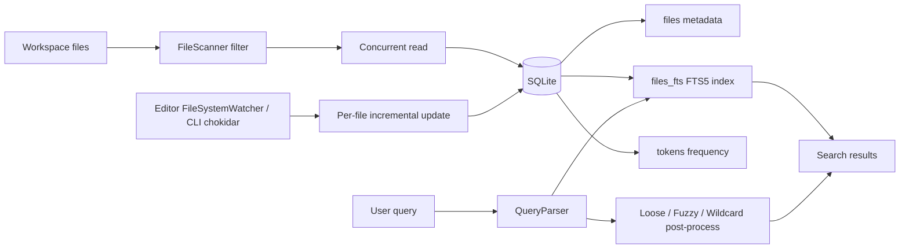

[中文](https://github.com/OscarKing888/CodeSearch/blob/main/README_Dev.md) | [English](https://github.com/OscarKing888/CodeSearch/blob/main/README_Dev_en.md)

User-facing docs: https://github.com/OscarKing888/CodeSearch/blob/main/README.md (Chinese) and https://github.com/OscarKing888/CodeSearch/blob/main/README_en.md (English).

## Development

### Windows

```bat
install.bat   REM Install dependencies (includes better-sqlite3 native build)
build.bat     REM Build, test, and package .vsix
```

### macOS / Linux

```bash
chmod +x install.sh build.sh install-extension.sh bump-version.sh
./install.sh
./build.sh
./install-extension.sh
```

Version bump (same as `bump-version.bat`):

```bash
./bump-version.sh 0.2.1 --notes "Fix Electron ABI 146 native packaging."
```

### Manual commands

```bash
npm install
npm run build
npm run rebuild:node   # CLI / MCP need system Node ABI for better-sqlite3
# Press F5 in VS Code with launch.json
```

### MCP (AI Agent)

Read-only stdio MCP server over existing Ace Code Search SQLite indexes:

```bash
npm run build
npm run rebuild:node
npm run mcp -- --db /path/to/index.db
# strict registry plus an explicit client workspace scope
npm run mcp -- --registry /path/to/registry.json --workspace-root /path/to/workspace
# tolerant auto-discovery of VS Code/Cursor globalStorage registries
npm run mcp
# opt in only when cross-workspace access is intentional
npm run mcp -- --all-indexes
```

#### MCP tools

| Tool | Purpose |
| --- | --- |
| `list_indexes` | List auto-discovered or explicitly configured indexes, roots, token counts, and completeness |
| `search_code` | Full-text search with index selection, case, phrase, fuzzy, loose matching, and query filters |
| `read_indexed_file` | Read a line range from an indexed file snapshot |
| `find_header_source` | Find indexed C/C++ header/source counterparts |
| `search_class_hierarchy` | Return a class's descendant inheritance DAG with source locations |

Key `search_code` parameters: `caseSensitive`, `phraseSearch`, `regex`, `fuzzy`, `loose` + `looseGap`, `contextLines`, and `maxResults`. `regex: true` enables per-line ECMAScript matching; a consecutive suffix of path/age filters remains active, while Phrase/Fuzzy/Loose are ignored. Query syntax supports `ext:`, `file:`, `dir:`, `age:`, `+/-` content filters, and wildcards. There is no dedicated strict `wholeWord` parameter; for names with hyphens or punctuation, split according to tokenization (e.g. search `better sqlite3` for `better-sqlite3`).

`search_class_hierarchy` is case-sensitive; a qualified name resolves uniquely, ambiguous short names return candidates. `maxNodes` is 1–5000 or `"all"`; when omitted, reads user setting `codeSearch.mcpClassHierarchyDefaultMaxNodes` (default 20, 0 means all). MCP is read-only and never writes databases or registries; Primary/Secondary selection and writer leases are editor-side operations.

#### Index discovery and read-only guarantees

- With no arguments, tolerantly discovers VS Code/Cursor registries; broken sources appear in `list_indexes.warnings`
- By default exposes only indexes fully contained by MCP client roots; after roots are advertised, empty/invalid roots clear scope with no cwd fallback
- Explicit `--registry` or `--db`; when multiple indexes are visible, pass `indexId`; cross-workspace requires `--all-indexes`
- Results come from **index snapshots**; build states other than `complete` return `partialIndex: true`

#### Agent integration and user status

Command **Ace Code Search: Install Agent Integration (Project Guidance + User MCP)** (toolbar document icon) writes:

- Project Skill: `.agents/skills/ace-code-search-mcp/SKILL.md`
- User launcher: `~/.ace-code-search/mcp-launcher.cjs`
- Codex / Cursor configs: `~/.codex/config.toml`, `~/.cursor/mcp.json`
- Supported VS Code builds discover via `ace-code-search.mcp-servers`

A Skill only documents usage; **tools do not appear without a registered MCP server**. Codex/Cursor require `node` on PATH (VSIX ships Node 20/22/24 bindings); VS Code provider uses the editor runtime. Project guidance stays only in `.agents`; normal install does not create project `.codex`, `.github`, `.cursor`, or `.claude` files.

Search panel status bar: gray **Waiting**, green **Ready**, yellow shows sanitized action summaries (e.g. `正在搜索 “xxx”`). Multiple IDE processes aggregate by workspace; each stdio session remains independent. Skill guidance prefers MCP when an index exists; falls back to `rg`/file reads when missing, incomplete, or unindexed.

Tools: `list_indexes`, `search_code`, `read_indexed_file`, `find_header_source`, `search_class_hierarchy`.
Results come from the **index snapshot**, not a live filesystem walk. Automatic discovery tolerates broken registries/databases and reports them through `list_indexes.warnings`; explicit `--db` and `--registry` sources remain strict. A missing legacy build-state marker is `unknown`, and every state other than `complete` returns `partialIndex: true`.

`search_class_hierarchy` resolves a case-sensitive qualified class name, or a unique short name, then returns its descendant graph as a flat DAG with indexed and mapped declaration locations. Ambiguous short names return structured candidates. Current cache declarations are reused; pending files are parsed through the shared two-worker parser with an event-loop fallback and are never persisted by MCP. `maxNodes` is 1–5000 or `"all"`; omission reads `~/.ace-code-search/settings.json`, which the application-scoped `codeSearch.mcpClassHierarchyDefaultMaxNodes` setting synchronizes for all clients (default 20, 0 means all). The settings file is not exposed as an MCP tool or result.

Default discovery is scoped to MCP client workspace roots, then explicit repeated `--workspace-root` arguments, then cwd. Every mapped index output root must be contained by a client root, so a parent index or mixed unrelated roots fail closed. Direct `--db` explicitly authorizes that database; `--all-indexes` explicitly opts into cross-workspace registry access. When multiple indexes remain visible, tools require `indexId`.

Codex/Cursor launchers and direct CLI/MCP runs use the system-Node binaries under `native-node/`. The VS Code MCP definition provider launches `process.execPath` with `ELECTRON_RUN_AS_NODE=1`, so a local Electron extension host selects the matching `native/` ABI; remote system-Node extension hosts select `native-node/`. Both paths resolve the installed extension root before loading `better-sqlite3`.

Workspace Primary/Secondary selection, `workspaceIndexBindingV2`, shared-index creation, and `<index.db>.writer.lock` are intentionally excluded from MCP: they mutate editor state or writer ownership. MCP still discovers per-editor registries (including shared/manual DB paths after an IDE registers them), supports explicit `--db`, opens databases read-only, and never acquires the writer lease.

#### Agent integration installation (implementation details)

Install behavior is described above in **Agent integration and user status**. Implementation notes:

- Launcher discovers the newest installed extension on every start; config is not pinned to a version path
- Managed files use owner/kind/content-hash markers; user-modified or invalid markers are preserved with warnings
- Verifiable legacy project `.codex`, `.cursor/skills`, `.cursor/rules`, `.claude/skills`, `.github/instructions` entries are migrated/cleaned up
- `resources/skills/ace-code-search-mcp/SKILL.md` must stay byte-identical to `.agents/skills/ace-code-search-mcp/SKILL.md`
- `codeSearch.installVscodeCopilotInstruction` is only an alias for the canonical installer

#### MCP runtime status

`src/mcpStatus.ts` defines the shared runtime record and editor monitor. Each stdio process writes a private atomic record under `~/.ace-code-search/status/`, refreshes its heartbeat every 2 seconds, and removes its own record on graceful shutdown. Tool wrappers store only sanitized summaries: search/class text is control-character-cleaned and truncated, file tools expose only the basename and line range, and index/database paths are never recorded.

The extension polls every 500 ms, filters sessions to overlapping workspace roots, treats heartbeats older than 6 seconds as unavailable, and deletes session files older than 60 seconds. Active or just-completed requests remain yellow for at least 2 seconds; concurrent sessions show the newest request plus a count. This cross-process aggregation is display-only: each launched stdio server retains an independent `McpIndexSession`, roots refresh generation, and response transport. Status persistence is best-effort, logs only to MCP stderr, and must never delay/fail tool responses or write to MCP stdout. Coverage: `test/mcpStatus.test.ts` and the multi-session assertions in `test/mcpTools.test.ts`.

#### MCP client workspace roots

`src/mcp/clientRoots.ts` bypasses the SDK's strict `file://` result schema for `roots/list` so Cursor versions that return an absolute Windows path in `Root.uri` remain compatible. Standard file URIs and platform-absolute raw paths are normalized per MCP process; relative and non-file values are rejected. A client that advertises roots has an authoritative scope: empty/invalid roots or a failed roots request clear the session to zero indexes rather than falling back to cwd. Clients without roots capability retain the documented `--workspace-root` / cwd compatibility fallback. `notifications/roots/list_changed` refreshes only that process, so simultaneous VS Code/Cursor windows cannot overwrite one another's scopes. Coverage: `test/mcpTools.test.ts`.

Cursor's shared MCP process may publish an initializing durable snapshot before it has requested `tools/list`, which leaves a connected user server visible with zero tools. `src/mcp/serverLifecycle.ts` sends `notifications/tools/list_changed` once the client sends `notifications/initialized`; this prompts a fresh snapshot while preserving the same five tool schemas and independent stdio session.

For local packaging, Cursor may resolve the user MCP `node` command to `Cursor/.../resources/helpers/node` rather than the system Node used by the build terminal. `build.bat` and `build.sh` therefore run `scripts/rebuild-node.js --all-detected`: it follows the installed Cursor CLI to that helper, stages every distinct detected Node 20/22/24 ABI under `native-node/`, and rebuilds the current system Node last so tests still load correctly. CI release packaging continues to merge the complete ABI 115/127/137 matrix on every supported platform.

#### Prefer-indexed-search guidance

- Canonical shared project Skill: installed under `.agents/skills` by the toolbar command above.
- Optional Cursor personal User Rule text: `resources/rules/cursor-user-rule.txt` via **Copy Cursor User Rule (Personal)**.

The guidance prefers indexed MCP tools for code discovery, but requires `rg`/filesystem/direct-read fallback when no matching index exists, `partialIndex` affects completeness, content may be stale, or files are excluded/unindexed. It never treats indexed snapshots as unsaved content.

`vscode:prepublish` only runs the normal `npm run build` (esbuild). Cross-platform Electron and Node native binaries are produced by the rebuild scripts and Release GitHub Actions workflow, not by `vscode:prepublish`. `npm run test:native` builds the runtime entries and runs the native matrix/VSIX/CLI smoke tests.

## Release

Pushing a `v*` tag triggers GitHub Actions to build cross-platform native modules, package the `.vsix`, create a GitHub Release, and publish to the VS Code Marketplace.

### One-time setup

Below is the SOP for configuring VS Code Marketplace publish permissions from scratch. Do this once; subsequent releases use GitHub Actions with `VSCE_PAT`.

#### 0. Accounts and permissions

1. Sign in with the same Microsoft account to:
   - Visual Studio Marketplace: <https://marketplace.visualstudio.com/manage>
   - Azure DevOps: <https://dev.azure.com/>
2. If multiple Microsoft/Azure accounts are signed in, use a private/incognito window to avoid Marketplace and Azure DevOps using different identities.
3. The PAT belongs to the user who created it. That account must have publish rights on the target Marketplace Publisher, or publish will fail even with a valid token.
4. Note: VS Code docs indicate Azure DevOps global PATs retire 2026-12-01; this project still uses PAT for now and will need migration to Microsoft Entra ID / managed identity later.

#### 1. Create an Azure DevOps organization (if needed)

1. Open <https://dev.azure.com/>.
2. Follow the wizard if prompted to create an Azure DevOps Organization.
3. Organization name need not match the Marketplace Publisher ID; the PAT only needs Marketplace scope access.
4. After creation, the org home is typically:

```text
https://dev.azure.com/<Your_Organization>
```

#### 2. Create a PAT

1. From the org home, open the PAT page directly:

```text
https://dev.azure.com/<Your_Organization>/_usersSettings/tokens
```

2. Or use the top bar: click **User settings** (person + gear icon, left of the account avatar), then **Personal access tokens**.
3. Do not use the rightmost avatar/account menu—that usually shows account switch/sign-out only. Use **User settings** or the URL above.
4. Click **+ New Token**.
5. Fill in:
   - **Name**: `ace-code-search-marketplace-publish`
   - **Organization**: **All accessible organizations**
   - **Expiration**: 90/180 days or your team's rotation policy; avoid no expiration
   - **Scopes**: **Marketplace → Manage** only
6. If Marketplace scope is missing:
   - Click **Show all scopes** at the bottom
   - Confirm the account has Publisher access in the Marketplace Publishing Portal
   - Contact your org admin if PAT policy blocks the scope
7. Click **Create**.
8. Copy the token immediately—it is shown only once.

#### 3. Create or confirm Marketplace Publisher

1. Open [Visual Studio Marketplace Publishing Portal](https://marketplace.visualstudio.com/manage).
2. Sign in with the same Microsoft account used for the PAT.
3. If no Publisher exists, click **+ Create a publisher**.
4. Publisher fields:
   - **ID**: publish ID; immutable after creation; must match `package.json` `publisher`
   - **Name**: display name
5. This project uses:

```json
"publisher": "OscarKing888"
```

6. If the Portal Publisher ID differs, update `package.json` and confirm no Marketplace name conflict.
7. Verify locally:

```bash
npx vsce login OscarKing888
```

8. If token verification succeeded, Publisher and PAT permissions match.

#### 4. Add GitHub Actions secret

1. Open the GitHub repository.
2. **Settings → Secrets and variables → Actions**
3. **New repository secret**
4. **Name**: `VSCE_PAT`; **Secret**: paste the PAT
5. Never commit the PAT to code, logs, issues, PRs, or docs.

#### 5. Verify publish permissions

1. GitHub **Actions → Release → Run workflow**
2. First run can skip Marketplace publish to verify VSIX packaging only.
3. Then enable Marketplace publish or push a version tag.
4. `VSCE_PAT not set` in logs means wrong secret name, not saved, or unavailable to the workflow.
5. Marketplace 401/403: check PAT expiry, **Marketplace → Manage** scope, `package.json` publisher match, and Publisher permissions for the PAT account.

References:

- Azure DevOps PAT: <https://learn.microsoft.com/en-us/azure/devops/organizations/accounts/use-personal-access-tokens-to-authenticate>
- Marketplace publishing overview: <https://learn.microsoft.com/en-us/azure/devops/extend/publish/overview>
- VS Code extension publishing: <https://code.visualstudio.com/api/working-with-extensions/publishing-extension>
- CLI publish and PAT: <https://learn.microsoft.com/en-us/azure/devops/extend/publish/command-line>

### Release steps

```bash
# 1. Update version in package.json
# 2. Update CHANGELOG.md
git add package.json CHANGELOG.md
git commit -m "chore: bump version to 0.1.8"
git tag v0.1.8
git push origin main --tags
```

Tag version must match `package.json` `version` (e.g. tag `v0.1.8` → version `0.1.8`).

You can also trigger **Actions → Release → Run workflow** manually and choose Marketplace publish (requires `VSCE_PAT`).

## Configuration

See VS Code Settings → **Ace Code Search** for exclude globs, context lines, phrase search default, fuzzy default, loose gap, and more.

## Phase 3 — Multi-Index & Tabs

- **Multi-tab results**: `Ctrl+Enter` new tab, lock tabs with 🔒, close with ×
- **Shared Primary**: new non-autocreate workspaces use one deterministic DB path shared by VS Code and Cursor; `Ace Code Search: Choose Workspace Primary Index...` also supports an auto-discovered candidate or manually selected `index.db`
- **Secondary indexes**: `Ace Code Search: Open Secondary Index` opens a discovered or manually selected DB read-only by default; writable mode requires known source roots and the writer lease
- **Index management**: toolbar ⚙ or `Ace Code Search: Manage Indexes` — see **Cross-IDE indexes (user guide)** below for panel layout and delete behavior
- **Autocreate**: add `code-search.autocreate` in workspace root (optional JSON config)
- **Directory mapping**: map `\\server\share => C:\local` for shared indexes
- **CLI**: `npm run cli -- create|update|list` (see https://github.com/OscarKing888/CodeSearch/blob/main/PHASE2.md)
- **MCP**: `npm run mcp` — read-only stdio tools for AI agents (see Development → MCP above)

### Cross-IDE indexes (user guide)

When VS Code and Cursor open the same folder or workspace on one machine, newly created workspace indexes default to one IDE-independent Primary database. Open **Manage Indexes** to see workspace roots, Primary source, access mode, and shared database path.

- **Shared Primary**: **Use Shared Index** or **Ace Code Search: Choose Workspace Primary Index...**; the picker also lists matching indexes auto-discovered from VS Code/Cursor registries
- **Manual Primary**: choose any existing `index.db`; read-only is recommended for existing databases, or select **Automatic single-writer**
- **Single-writer safety**: automatic mode uses `<index.db>.writer.lock` so only one IDE writes; the other IDE searches read-only and shows the current writer; after the writer closes, an idle reader takes over writes
- **Crash recovery**: dead-process writer locks are reclaimed automatically; malformed `.writer.lock` or leftover `.writer.lock.reclaim` require closing all IDEs using that index before manual deletion—the extension never auto-deletes these to avoid dual writers
- **Secondary**: **Open Secondary...** opens auto-discovered or manual databases; read-only by default; automatic single-writer when source roots are known; open Secondaries participate in every search
- **Safe read-only**: read-only indexes never scan, watch, migrate schema, or write; invalid databases fail before replacing the active Primary
- **Property scopes**: Primary is dominant, Secondaries subordinate; `Index content` vs `This workspace` are separate; Unreal default excludes are read-only; Additional exclusions are editable per index
- **Delete Available indexes**: **Delete** shows the full path for confirmation, then permanently removes the DB and WAL/SHM; active or locked indexes are refused
- **Legacy compatibility**: original `globalStorage` indexes are not auto-moved; they reopen as Legacy; `code-search.autocreate` still takes precedence

Shared database locations:

- Windows: `%LOCALAPPDATA%\AceCodeSearch\indexes\<workspace-key>\index.db`
- macOS: `~/Library/Application Support/AceCodeSearch/indexes/<workspace-key>/index.db`
- Linux: `${XDG_DATA_HOME:-~/.local/share}/AceCodeSearch/indexes/<workspace-key>/index.db`

`workspace-key` is derived from normalized, sorted workspace roots.

### Cross-IDE Primary binding and compatibility

Startup precedence is: `code-search.autocreate` → a valid `workspaceIndexBindingV2.<workspace-hash>` Primary → matching legacy/current registry entry → the pre-shared default `{globalStorage}/code-search/<workspace-hash>/index.db` → deterministic shared path → create/choose prompt. Probing the old deterministic path preserves existing indexes even if an older `registry.json` was lost or reset. A missing, corrupt, or incompatible saved/legacy database is logged and skipped so the next distinct candidate can still open; the same failed physical path is not retried through duplicate registry metadata. If no replacement is selected, the unresolved saved Primary binding is preserved for a later retry instead of being erased. `code-search.autocreate` remains authoritative and intentionally fails startup when its configured index cannot open.

Bindings are separated by workspace hash inside editor `workspaceState` and store paths rather than registry IDs, because VS Code and Cursor maintain separate registries. The old `secondaryIndexIds` value is still written for downgrade compatibility, but it is imported only once into V2 state; afterward a keyed binding (including an empty Secondary list) is authoritative so changing workspace roots cannot inherit another root set's Secondary indexes. A keyed Secondary that is temporarily missing, invalid, or unavailable remains in the binding across routine saves and shutdown, so a later startup can retry it; only an explicit **Close** or Available **Delete** removes that path. Writable Secondary restore opens, registers, and persists the service first, then scans in the background, so a large Secondary cannot block the management/search UI during extension activation. Interactive **Open Secondary** uses the same non-blocking behavior; explicit standalone index creation retains its progress-wait flow.

Default shared paths:

| Platform | Path |
| --- | --- |
| Windows | `%LOCALAPPDATA%\AceCodeSearch\indexes\<workspace-key>\index.db` |
| macOS | `~/Library/Application Support/AceCodeSearch/indexes/<workspace-key>/index.db` |
| Linux | `${XDG_DATA_HOME:-~/.local/share}/AceCodeSearch/indexes/<workspace-key>/index.db` |

`workspace-key` is a SHA-256 prefix over the sorted canonical workspace roots, so root ordering and Windows path casing do not split VS Code and Cursor onto different shared databases. The existing 32-bit workspace hash remains the editor initialization identity and continues to name legacy/autocreate paths, registry associations, and workspace binding entries.

Existing `globalStorage/.../code-search/<hash>/index.db` files remain in place and reopen as `legacy`; no automatic copy or deletion occurs. Candidate discovery reads both VS Code and Cursor registries, accepts exact normalized root matches or a legacy workspace-hash match, deduplicates by physical DB path, and ignores a temporarily unreadable peer registry.

Requested access modes are `readOnly` and `auto`. `auto` writes and fsyncs the owner JSON to a same-directory temporary file, then atomically publishes `<index.db>.writer.lock` with a no-replace hard link; the winner opens writable, while a contender waits briefly for first-use schema creation, then opens the same SQLite DB read-only and reports the writer label. Filesystems without hard-link support fall back to exclusive create, but a malformed/incomplete main lock is then deliberately never auto-reclaimed: close every IDE using that index before manually removing it. Read-only services use `fileMustExist` and SQLite `query_only`, validate the required schema, and never create/migrate tables, scan roots, or start a watcher. Writer locks are released only by their token owner, and a valid dead main-lock owner is reclaimed behind a second atomic-create guard. An existing `<index.db>.writer.lock.reclaim` is likewise intentionally fail-safe and is never auto-deleted because filesystem check-then-unlink cannot atomically prove that another process did not replace it; if a process dies during that very small recovery window, close every IDE using the index before manually deleting the orphan guard. When the writer exits normally, or leaves only the valid main lock, an idle automatic reader periodically acquires ownership, reopens writable, and starts indexing/watching without a reload.

Primary replacement is validated before the old Primary closes. Promoting an attached Secondary removes the duplicate service, and the active Primary path cannot also be attached as a Secondary. A writable DB with unknown roots requires explicit source-root selection. Live DB moves are rejected; only inactive catalog entries are eligible in the manager. Physical delete holds the registry writer lease from the final merged-reference check through unlink. Move validates its merged destination and commits or rolls its catalog path back while holding that same lease; after a successful `COPYFILE_EXCL`, an ambiguous failed commit leaves the destination copy for manual recovery instead of deleting a path a peer may have claimed.

Command-palette Primary/Secondary/create flows capture the current manager plus workspace identity before opening native pickers. If workspace folders change while a picker or database open is pending, the old result may still be reported but cannot update the new workspace binding, Primary source, or search service.

### Cross-IDE verification

```bash
npx ts-node test/sharedIndexStorage.test.ts
npx ts-node test/workspaceIndexBinding.test.ts
npx ts-node test/workspaceOperationGuard.test.ts
npx ts-node test/indexWriterLease.test.ts
npx ts-node test/indexDiscovery.test.ts
npx ts-node test/indexRegistry.test.ts
npx ts-node test/indexPresence.test.ts
npx ts-node test/startupPrimarySelection.test.ts
npx ts-node test/indexManager.test.ts
npx ts-node test/indexServiceDispose.test.ts
npx ts-node test/indexServiceRecovery.test.ts
npm test
npx tsc --noEmit
npm run build
```

Manual smoke test: open the same workspace in VS Code and Cursor, select the shared Primary in both, and confirm one shows writable while the other names that writer and remains read-only. Then verify manual Primary selection survives reload, Secondary attachments restore, missing/non-Ace DBs fail without replacing the working Primary, and an autocreate workspace disables panel Primary changes.

### Large workspace performance

For very large codebases (validated on UE 5.61), 0.4.x+ focuses on fixing "**Up to date** but Extension Host still at high CPU and search feels stuck." Profiling on a warm index: an `AActor`-style FTS query reaches ~**200ms** for 10k hits; the bottleneck is usually file watching and UI delivery in the Extension Host, not SQLite. See **Indexing & search algorithm** below for algorithm details.

**File watching**

- VS Code/Cursor use the editor's native `FileSystemWatcher`; recursive watching runs in the file service process
- CLI keeps chokidar fallback
- include/exclude matchers are compiled once; indexing pauses during search and drains queued events afterward
- Status shows **Up to date** only after watchers are ready

**Streaming search & results panel**

- FTS cursor iteration streams hits: first batch **50**, then **500** per batch
- Extension posts to the webview in **100**-row chunks and waits for ACK
- Webview uses plain text for the first batch, then merges later batches via `requestAnimationFrame`
- **Updating** shows loaded/found counts so hit totals are not mistaken for fully rendered rows

**Diagnostic logs (optional)**

- `codeSearch.profileSearch` is off by default; when enabled, writes JSONL with 250ms checkpoints
- `codeSearch.openProfileLogFolder` opens the log folder; `latest-profile.jsonl` points to the latest session

Targets after indexing completes: first `AActor` batch ≤500ms, 10k hits ≤5s, Extension Host CPU drops quickly when idle.

## Feature status

✅ Done · 🟡 Partial · ⬜ Planned

| Category | Feature | Status |
|----------|---------|--------|
| **Indexing** | Workspace full-text indexing / autocreate roots | ✅ |
| | Shared VS Code/Cursor Primary, manual Primary, single writer | ✅ |
| | Multi-root / Secondary / path mapping | ✅ |
| | Incremental updates (editor native watcher; CLI chokidar) | ✅ |
| | Low-priority background throttling (Be extra nice) | ⬜ |
| | Binary exclusion / excludeGlobs / Unreal defaults | ✅ |
| | Automatic `.gitignore` | ⬜ |
| | Per-index include/exclude | 🟡 exclude has Advanced UI |
| | Scanning / Indexing / Up to date status | ✅ |
| | Search while partially indexed / force refresh | ✅ |
| | Changed-only / all-files refresh modes | ⬜ |
| | Index management panel (Primary / Secondary / Delete) | ✅ |
| | Ace Code Search CLI | ✅ |
| **AI Agent** | Read-only MCP (search / read / hierarchy / header-source) | ✅ |
| | Skill and MCP status bar | ✅ |
| **Search** | Word / phrase / fuzzy / loose / wildcards / per-line regex / filter-only | ✅ |
| | Case / phrase default / context lines | ✅ |
| **Filters** | `ext:` / `file:` / `dir:` / `age:` / `+/-` | ✅ |
| **Results UI** | Bottom panel / tabs / lock / sort / autocomplete / regex snippet menu | ✅ |
| | Syntax highlighting | 🟡 rule-based |
| | C++ class inheritance tree | ✅ |
| **Navigation** | Alt+= search selection / hit navigation / Shift+Alt+F | ✅ |
| | Alt+O header/source / auto-open single hit | ✅ |

## Roadmap

See https://github.com/OscarKing888/CodeSearch/blob/main/PHASE2.md — Phase 2 & 3 complete.

---

## Architecture & implementation

### Architecture overview



**Technology stack**

- **Language**: TypeScript + VS Code Extension API
- **Index engine**: `better-sqlite3` + SQLite FTS5 (persistent, BM25 ranking, suitable for millions of hits)
- **File watching**: VS Code/Cursor native `FileSystemWatcher`; CLI/non-editor uses chokidar fallback
- **Fuzzy search**: edit distance + FTS5 post-processing (`FuzzyMatch.ts`)
- **UI**: WebviewView + Vanilla TS frontend
- **Syntax highlighting**: `vscode-textmate` + current theme token colors
- **Build**: `esbuild` bundles extension + webview

**Index storage**: new workspaces default to the IDE-independent `AceCodeSearch/indexes/<workspace-key>/index.db` above; `context.globalStorageUri/code-search/` keeps registry and legacy DB compatibility. `code-search.autocreate` can still set `indexLocation`.

### Project structure

```
.
├── package.json
├── tsconfig.json
├── esbuild.js
├── ess.bat / ess.sh          # CLI entry scripts
├── src/
│   ├── extension.ts          # activation, commands, lifecycle
│   ├── cli/index.ts          # standalone CLI (create / update / list)
│   ├── mcp/                  # read-only stdio MCP
│   │   ├── server.ts
│   │   ├── session.ts
│   │   ├── tools.ts
│   │   └── discover.ts
│   ├── index/
│   │   ├── IndexService.ts   # indexing, incremental updates, status
│   │   ├── IndexManager.ts   # multi-index registration
│   │   ├── IndexWriterLease.ts # single-writer lock, dead-process reclaim
│   │   ├── sharedIndexStorage.ts # cross-IDE shared paths
│   │   ├── workspaceIndexBinding.ts # Primary/Secondary path bindings
│   │   ├── indexDiscovery.ts # merge VS Code/Cursor registry candidates
│   │   ├── FileScanner.ts    # traversal, binary/exclude filtering
│   │   ├── FileWatcher.ts    # editor native watcher + chokidar fallback
│   │   ├── Autocreate.ts     # code-search.autocreate parsing
│   │   └── schema.sql        # FTS5 schema
│   ├── native/
│   │   └── betterSqlite3.ts  # native module load + Electron ABI resolution
│   ├── search/
│   │   ├── QueryParser.ts    # ext:/dir:/age:/loose: parsing
│   │   ├── SearchService.ts  # FTS5 MATCH + post-processing
│   │   ├── MultiIndexSearchService.ts
│   │   ├── WildcardMatcher.ts
│   │   ├── LooseSearch.ts
│   │   └── FuzzyMatch.ts
│   ├── ui/
│   │   ├── SearchPanelProvider.ts
│   │   ├── IndexManagePanel.ts
│   │   ├── webview/main.ts
│   │   └── manage-webview/main.ts
│   └── utils/
│       └── syntaxHighlight.ts
└── media/
```

### Database schema (core)

```sql
-- File metadata
CREATE TABLE files (
  id INTEGER PRIMARY KEY,
  path TEXT UNIQUE NOT NULL,
  mtime INTEGER NOT NULL,
  size INTEGER NOT NULL,
  ext TEXT,
  dir TEXT,
  content TEXT NOT NULL DEFAULT ''
);

-- FTS5 full-text index
CREATE VIRTUAL TABLE files_fts USING fts5(
  path UNINDEXED,
  content,
  tokenize='unicode61 remove_diacritics 0'
);

-- Token frequency (autocomplete)
CREATE TABLE tokens (
  token TEXT PRIMARY KEY,
  freq INTEGER DEFAULT 1
);
```

Indexing flow: scan files → read text → INSERT/UPDATE `files` + sync `files_fts` → extract tokens into `tokens`.

### Search query syntax

User input is parsed into a structured object:

```
Input:  myVar ext:h,cpp,inc dir:src/** -file:*.test.* age:2h
Output: { terms: ["myVar"], filters: { ext: ["h", "cpp", "inc"], dir: ["src/**"], fileExclude: ["*.test.*"], ageMax: "2h" } }
```

- **FTS5 queries**: words/phrases map to FTS5 MATCH syntax
- **Filter tokens**: filters are recognized only outside quotes as standalone whitespace-delimited items; same-kind includes use OR, different kinds use AND, and exclusions win
- **Path globs**: `file:` / `dir:` use case-insensitive standard glob syntax with normalized separators (`*` stays in one segment, `**` crosses directories, `?` matches one character); `ext:` accepts comma-separated values
- **Content wildcards**: word-level `*` → FTS5 prefix query (`token*`); inline/cross-line wildcards use `WildcardMatcher` post-processing
- **age filter**: SQL `WHERE mtime > ?` joined with FTS results
- **ext/dir/file filters**: match both indexed paths and directory-mapped local paths
- **Filter-only**: no search terms → direct SELECT on `files`
- **Regex**: raw ECMAScript patterns are matched per line without `/.../flags`; only a trailing consecutive path/age-filter suffix is parsed, multiline matches are unsupported, and large-index scans may be slower than FTS
- **Candidate iteration**: candidates are not capped before path/content post-filters; synchronous and streaming searches iterate lazily until the real result limit

### Search panel UI

```
┌─────────────────────────────────────────────────────────────┐
│ [Search: myVar ext:cpp]  [Aa] [""] [Fz] [~] [.* ▾] [⟳]    │
│  Case  Phrase Fuzzy Loose Regex/Menu Refresh                │
├─────────────────────────────────────────────────────────────┤
│ 1,234 hits in 56 files · 0.08s          Indexing: 42% ████░ │
├─────────────────────────────────────────────────────────────┤
│ ▼ src/utils/parser.ts:42                                    │
│   const myVar = parse(input);   // highlighted line         │
│ ▼ src/core/handler.ts:108                                   │
│   return myVar.toString();                                    │
└─────────────────────────────────────────────────────────────┘
```

- Docked in the Panel bottom area (`viewsContainers` + `views`)
- Message protocol: `search` / `openFile` / `indexStatus` / `updateSettings`

### Commands & shortcuts

| Command | Default shortcut | Description |
|---------|------------------|-------------|
| `codeSearch.searchSelection` | `Alt+=` | Search word under cursor / selection |
| `codeSearch.focusSearch` | `Shift+Alt+=` | Focus search box |
| `codeSearch.quickOpenFile` | `Shift+Alt+F` | File filter mode |
| `codeSearch.nextHit` | `Ctrl+Alt+]` | Next hit (when panel focused) |
| `codeSearch.prevHit` | `Ctrl+Alt+[` | Previous hit (when panel focused) |
| `codeSearch.switchHeaderSource` | `Alt+O` | Switch header/source in index (C/C++); pair must exist in indexed `files`; priority: same-dir stem → UE Public↔Private → closest path; auto-migrates legacy Alt+O bindings and overrides `C_Cpp.SwitchHeaderSource` / `clangd.switchheadersource` |
| `codeSearch.refreshIndex` | — | Force full rebuild |
| `codeSearch.manageIndexes` | — | Open Primary / Secondary management |
| `codeSearch.selectPrimaryIndex` | — | Choose shared, discovered, or manual `index.db` as Primary |
| `codeSearch.openSecondaryIndex` | — | Open read-only or auto single-writer Secondary |
| `codeSearch.createIndex` | — | Create and open a writable Secondary |
| `codeSearch.openClassHierarchy` | — | Open full indexed C++ class hierarchy panel |

### Class inheritance tree

Click the hierarchy icon in the search toolbar—no search required—to view indexed C/C++ `class` / `struct` inheritance; clicking a class opens its declaration at the indexed line.

- Declarations are cached in writable indexes; invalidated on source changes; up to two background threads incrementally update during search/index idle time and commit in batches
- Read-only legacy indexes use in-memory fallback parsing without writes
- Supports UE `MODULE_API`, namespaces, multiline declarations, `final`, multiple inheritance, access modifiers, virtual bases; out-of-index bases appear as gray external nodes
- Large graphs start collapsed, cap at 5,000 tree nodes per render; clearing filter returns to the selected class; context menu expands/collapses all subclasses

### Settings

- `codeSearch.excludeGlobs` — global excludes; defaults include Unreal `Binaries`, `DerivedDataCache`, `Intermediate`, `Saved`, plus common `node_modules`, `dist`, `bin`, `obj`
- `codeSearch.includeGlobs` — include patterns (default `**/*`)
- `codeSearch.contextLines` — context lines per hit when Ctx is on (default 1, range 0–10)
- `codeSearch.phraseSearchDefault` — default phrase mode
- `codeSearch.autoOpenSingleHit` — auto-open when exactly one hit
- `codeSearch.maxResults` — max results (default 10000)
- `codeSearch.indexOnStartup` — index on workspace open

### Key implementation details

**1. Binary detection**: read up to 8KB of file header; skip if null bytes or non-printable ratio > 30%, or excessive UTF-8 replacement characters.

**2. Index performance**: batch transactions (commit every 100 files); `IndexService` pauses scanning during search/input (`pauseIndexing()`).

**3. Cross-IDE index ownership**: `IndexManager` stores requested/effective access; `IndexWriterLease` picks one writer; contenders open read-only and idle readers can take over after the writer exits. Primary switch opens and persists the new service before closing the old one; async dispose waits for lease release; `IndexService` generation stops stale scans. Physical delete holds registry writer lease through final reference check and cleanup; DB move is non-overwriting copy/repoint with source/target leases.

**4. Class hierarchy cache**: `ClassHierarchyCacheManager` reads pending sources only when search and indexing are idle; up to two workers parse; extension thread batch-commits `class_hierarchy_*` tables. Read-only secondaries without cache use one-shot in-memory parsing when opening the tree.

**5. Syntax highlighting**: webview fetches current `colorTheme` via `postMessage`, tokenizes with `vscode-textmate`, maps to CSS classes.

**6. Native module**: `better-sqlite3` is prebuilt for VS Code/Cursor Electron ABI and system Node ABI. Electron artifacts under `native/<platform>-<arch>-<abi>/`; Node 20/22/24 matrix under `native-node/...`. Release workflow builds and validates 24 entries. `vscode:prepublish` runs esbuild only; use `npm run test:native` for local native/VSIX/CLI regression.

**7. vs built-in search**: this extension **complements** VS Code search with pre-indexed full-text search; it does not modify the built-in Search panel.

## Indexing & search algorithm

This extension uses **SQLite FTS5 inverted full-text indexing**—not vector/semantic search and not a custom search engine. Summary: pre-built index + FTS5 retrieval + custom filters and post-processing.

### Data flow



### Indexing phase

Implementation: `src/index/IndexService.ts`, `FileScanner.ts`, `FileWatcher.ts`.

**Storage** (see `src/index/schema.sql`):

| Table | Role |
|-------|------|
| `files` | path, mtime, size, extension, directory, full content |
| `files_fts` | FTS5 virtual table on `content` |
| `tokens` | token frequency for autocomplete |

FTS5 tokenizer (actual code):

```sql
tokenize='unicode61 remove_diacritics 0'
```

SQLite **unicode61** tokenization; no Porter stemming.

**Scan & filter** (`FileScanner.ts`):

1. Recursive workspace traversal (stack DFS)
2. Exclude via `excludeGlobs`, directory names, file size, etc.
3. Extension whitelist + binary detection:
   - known binary extensions skipped
   - read up to 8KB header: >30% null/non-printable or bad UTF-8 → binary
4. Text files read fully into the database

**Write path** (`IndexService.ts`):

1. **Full/incremental**: skip unchanged files by `mtime`
2. **Batch transactions**: commit every 100 files
3. Per file: `INSERT/UPDATE files` → update `files_fts` (delete then insert) → regex `/[a-zA-Z_][a-zA-Z0-9_]*/g` extracts identifiers into `tokens` (max 500 per file, length ≥2)
4. **Concurrent reads**: configurable `codeSearch.indexThreads`; `pause()` indexing during search
5. **Incremental updates**: chokidar/editor watcher re-indexes single files on change

Database uses WAL (`journal_mode = WAL`); default path see **Index storage** above.

### Search phase

Implementation: `src/search/SearchService.ts`, `QueryParser.ts`.

**Standard search: FTS5 + BM25**

1. `QueryParser` parses terms and `ext:` / `dir:` / `file:` / `age:` filters
2. Search terms → FTS5 `MATCH` syntax (supports `*` prefix wildcards)
3. `files_fts MATCH ?` joined with `files`
4. FTS5 default **BM25** relevance ranking
5. Further SQL or in-memory filtering by path, extension, mtime, `+/-` content filters

**Advanced modes** (beyond FTS):

| Mode | Approach |
|------|----------|
| **Loose phrase** | FTS pre-filters files, then token-gap algorithm in memory (`LooseSearch.ts`) |
| **Fuzzy** | edit distance on candidates when FTS results are insufficient (`FuzzyMatch.ts`) |
| **Inline/cross-line wildcards** | FTS coarse filter + `WildcardMatcher` on content |
| **Filter-only** | no search terms → query `files` by path/extension |

**Streaming & index coordination** (large workspaces: see **Large workspace performance**): pause file watching and indexing during search; first 50 hits paint quickly, later batches use webview ACK backpressure; `codeSearch.indexThreads` speeds initial builds.

### vs VS Code built-in search

| | Ace Code Search | VS Code built-in |
|--|-----------------|------------------|
| Approach | Pre-indexed (background build) | Live ripgrep scan |
| Engine | SQLite FTS5 inverted index | ripgrep regex |
| Large repos | Usually faster after indexing | Scans files each search |
| Storage | Local `.db` on disk | No persistent index |

### One-line summary

> Scan & filter files → store full text in SQLite → **FTS5 unicode61 inverted index (BM25)** → FTS MATCH + metadata filters → Loose / Fuzzy / Wildcard post-processing when needed.

### Risks & mitigations

| Risk | Mitigation |
|------|------------|
| `better-sqlite3` native build fails across VS Code versions | Prebuilt binaries + GitHub Actions multi-platform builds; Node version docs |
| Very large first-time index | Search while indexing + progress + configurable excludes |
| FTS5 cannot express all wildcard semantics | SQL filter + in-memory matching for complex wildcards |
| F8 / Shift+Alt+arrows conflict with built-in shortcuts | Default `Ctrl+Alt+]` / `Ctrl+Alt+[`; panel webview focus only; customizable |
| `Alt+O` conflicts with other header/source extensions | Unbind legacy commands; migrate user Alt+O bindings; override `C_Cpp.SwitchHeaderSource` / `clangd.switchheadersource` |

### References

- [SQLite FTS5](https://www.sqlite.org/fts5.html)
