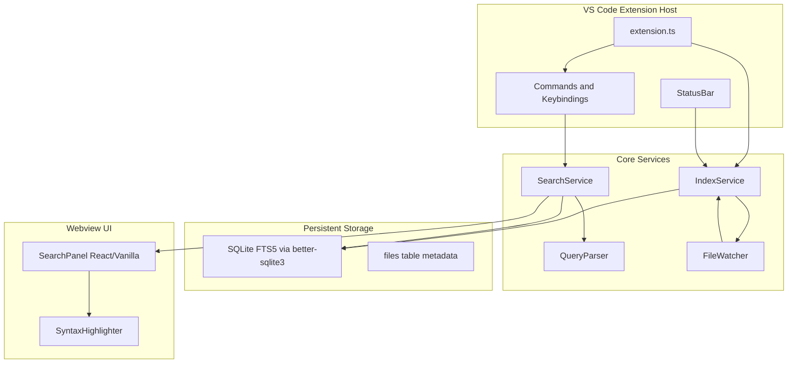

## Development

### Windows

```bat
install.bat   REM 安装依赖（含 better-sqlite3 原生编译）
build.bat     REM 编译、测试并打包 .vsix
```

### macOS / Linux

```bash
chmod +x install.sh build.sh
./install.sh
./build.sh
```

### 手动命令

```bash
cd source-search
npm install
npm run build
# Press F5 in VS Code with launch.json
```

## Configuration

See VS Code Settings → **Code Search** for exclude globs, context lines, phrase search default, fuzzy default, loose gap, and more.

## Phase 3 — Multi-Index & Tabs

- **Multi-tab results**: `Ctrl+Enter` new tab, lock tabs with 🔒, close with ×
- **Secondary indexes**: `Code Search: Open Secondary Index` — search third-party libs
- **Index management**: toolbar ⚙ or `Code Search: Manage Indexes` — opens a dedicated **Manage Indexes** editor tab (WebviewPanel) with index cards, filter, inline rename, directory mappings, attach/detach, delete, and refresh. Create / attach / move still use native VS Code file dialogs.
- **Autocreate**: add `source-search.autocreate` in workspace root (optional JSON config)
- **Directory mapping**: map `\\server\share => C:\local` for shared indexes
- **CLI**: `npm run cli -- create|update|list` (see [PHASE2.md](PHASE2.md))

## Roadmap

See [PHASE2.md](PHASE2.md) — Phase 2 & 3 complete.


---
name: Entrian VSCode 搜索插件
overview: 在空的 VSCodePlugins 目录中从零搭建一个 VS Code 扩展，以 SQLite FTS5 为核心实现 Entrian Source Search 的核心体验（全文索引、即时搜索、过滤、语法高亮结果），并规划后续阶段补齐模糊/松散搜索、多标签、二级索引等高级功能。
todos:
  - id: scaffold
    content: 创建 source-search 扩展脚手架（package.json、tsconfig、esbuild、基础 manifest）
    status: completed
  - id: index-service
    content: 实现 IndexService + SQLite FTS5 schema + FileScanner + chokidar 增量更新
    status: completed
  - id: query-parser
    content: 实现 QueryParser（单词/短语/通配符 + ext/dir/file/age 过滤）
    status: completed
  - id: search-service
    content: 实现 SearchService（FTS5 MATCH + 过滤 JOIN + 结果上下文提取）
    status: completed
  - id: webview-panel
    content: 实现 WebviewView 搜索面板（搜索框、工具栏、结果列表、消息桥）
    status: completed
  - id: syntax-highlight
    content: 集成 vscode-textmate 实现结果语法高亮
    status: completed
  - id: commands
    content: 注册命令与快捷键（Alt+=、Ctrl+Alt+]/[、Shift+Alt+F 等）
    status: completed
  - id: settings
    content: 添加配置项（排除规则、上下文行数、短语默认等）+ 索引状态栏
    status: completed
  - id: phase2-plan
    content: （后续）Loose/Fuzzy 搜索、自动补全、多标签页、二级索引
    status: completed
isProject: false
---

# Entrian Source Search 功能对标 VS Code 插件实现计划

## 功能对标清单

基于 [Entrian Source Search 官网](https://entrian.com/source-search/)、[QuickStart](https://entrian.com/source-search/manual.html)、[搜索手册](https://entrian.com/source-search/doc-searching.html) 和 [索引手册](https://entrian.com/source-search/doc-indexing.html) 整理：

| 类别 | Entrian 功能 | MVP | 后续阶段 |
|------|-------------|-----|---------|
| **索引** | 可配置根目录全文索引 | 工作区根目录自动索引 | 多根目录、二级只读索引、目录映射 |
| | 增量更新（文件监视器） | chokidar 实时更新 | 低优先级后台节流 |
| | 排除二进制/可配置排除 | 内置 + `.gitignore` + 配置 | 每索引独立 include/exclude |
| | 索引状态（Scanning/Indexing/Up to date） | 状态栏 + 工具栏提示 | 队列详情 tooltip |
| | 部分索引即可搜索 | 支持 | — |
| | 强制刷新 | 命令面板 | changed-only / all-files |
| | 索引管理对话框 | — | ✅ 专属 WebviewPanel（创建/删除/移动/重命名/映射） |
| | `EntrianSourceSearch.autocreate` | — | JSON 自动创建 |
| | CLI 索引工具 (ess.exe) | — | 独立 Node CLI |
| **搜索** | 单词/多词/短语 | 全部 | — |
| | 通配符 `*`（单词/行内/跨行） | 单词级通配符 | 行内/跨行通配符 |
| | Loose 松散短语 `loose:"A B"` | — | Phase 2 |
| | Fuzzy 模糊搜索 | — | Phase 2 |
| | 大小写敏感切换 | 支持 | — |
| | 短语搜索默认开关 | 支持 | — |
| | 仅过滤搜索 `file:*x* dir:y` | 支持 | — |
| **过滤** | `ext:` / `file:` / `dir:` | 全部 | — |
| | `age:` 文件修改时间 | 支持 | — |
| | `+` / `-` 包含/排除过滤 | 基础支持 | 文件内容正负过滤 |
| **结果 UI** | 底部停靠搜索窗口 | WebviewView 面板 | — |
| | 语法高亮结果 | TextMate 高亮 | — |
| | 命中数/耗时统计 | 支持 | — |
| | 上下文行数（Verbosity） | 可配置行数 | 滑块 UI |
| | 查询语法着色（绿/红过滤） | 搜索框基础高亮 | 完整着色 |
| | 多标签页 | — | Phase 3 |
| | 标签锁定 | — | Phase 3 |
| | 代码词自动补全 | — | Phase 2 |
| **导航** | 光标下单词搜索 | 支持 | — |
| | Ctrl+Alt+] / Ctrl+Alt+[ 跳转下/上命中 | 支持 | — |
| | Shift+Alt+F 快速打开文件 | 支持 | — |
| | 单击打开/预览 | 支持 Preview | — |
| | 唯一命中自动打开 | 可配置 | — |

---

## 技术架构



**技术选型**

- **语言**: TypeScript + VS Code Extension API
- **索引引擎**: `better-sqlite3` + SQLite FTS5（持久化，BM25 排序，适合百万级命中）
- **文件监视**: `chokidar`（跨平台，支持 `.gitignore`）
- **模糊搜索 (Phase 2)**: `fuse.js` 或 FTS5 trigram 扩展
- **UI**: WebviewView + 轻量前端（建议 Vanilla TS 或 Preact，避免过重）
- **语法高亮**: 复用 VS Code `vscode-textmate` + 当前主题 token 颜色
- **构建**: `esbuild` 打包 extension + webview

**索引存储位置**: `context.globalStorageUri/source-search/<workspace-hash>/index.db`

---

## 项目结构

在 [`D:\chatGPT\VSCodePlugins`](D:\chatGPT\VSCodePlugins) 下创建：

```
source-search/
├── package.json              # contributes: views, commands, keybindings, configuration
├── tsconfig.json
├── esbuild.js
├── src/
│   ├── extension.ts          # 激活、注册命令、生命周期
│   ├── index/
│   │   ├── IndexService.ts   # 建索引、增量更新、状态管理
│   │   ├── FileScanner.ts    # 遍历、过滤二进制/排除规则
│   │   ├── FileWatcher.ts    # chokidar 监听
│   │   └── schema.sql        # FTS5 表结构
│   ├── search/
│   │   ├── QueryParser.ts    # 解析 ext:/dir:/age:/loose: 等
│   │   ├── SearchService.ts  # FTS5 MATCH + 后处理
│   │   └── WildcardExpander.ts
│   ├── ui/
│   │   ├── SearchPanelProvider.ts  # WebviewView 消息桥
│   │   └── webview/            # 搜索面板前端
│   │       ├── index.html
│   │       ├── main.ts
│   │       └── styles.css
│   └── utils/
│       ├── tokenizer.ts        # 代码分词（供自动补全）
│       └── syntaxHighlight.ts
└── media/                      # 图标
```

---

## 数据库 Schema（核心）

```sql
-- 文件元数据
CREATE TABLE files (
  id INTEGER PRIMARY KEY,
  path TEXT UNIQUE NOT NULL,
  mtime INTEGER NOT NULL,
  size INTEGER NOT NULL,
  ext TEXT,
  dir TEXT
);

-- FTS5 全文索引（content 外部存储模式节省空间）
CREATE VIRTUAL TABLE files_fts USING fts5(
  path UNINDEXED,
  content,
  content='files',
  content_rowid='id',
  tokenize='porter unicode61'
);

-- 词频表（Phase 2 自动补全）
CREATE TABLE tokens (
  token TEXT PRIMARY KEY,
  freq INTEGER DEFAULT 1
);
```

索引流程：扫描文件 → 读文本 → INSERT/UPDATE `files` + 同步 `files_fts` → 提取 token 更新 `tokens`。

---

## 查询语法实现（MVP）

解析 Entrian 风格查询为结构化对象：

```
输入: myVar ext:cpp dir:utils -file:ChangeLog age:2h
输出: { terms: ["myVar"], filters: { ext: ["cpp"], dir: ["utils"], fileExclude: ["ChangeLog"], ageMax: "2h" } }
```

- **FTS5 查询**: 单词/短语直接转 FTS5 MATCH 语法
- **通配符**: 单词级 `*` 转 FTS5 prefix query（`token*`）
- **age 过滤**: SQL `WHERE mtime > ?` 与 FTS 结果 JOIN
- **ext/dir/file 过滤**: 对 `files` 表路径匹配（glob）
- **仅过滤**: 无搜索词时直接 SELECT files 表

---

## UI 设计（对标 Entrian 搜索窗口）

```
┌─────────────────────────────────────────────────────────────┐
│ [搜索框: myVar ext:cpp]  [Aa] [""]  [⟳]  [⚙]              │
│  Case  Phrase  Refresh  Settings                            │
├─────────────────────────────────────────────────────────────┤
│ 1,234 hits in 56 files · 0.08s          Indexing: 42% ████░ │
├─────────────────────────────────────────────────────────────┤
│ ▼ src/utils/parser.ts:42                                    │
│   const myVar = parse(input);   // 语法高亮行                │
│ ▼ src/core/handler.ts:108                                   │
│   return myVar.toString();                                    │
└─────────────────────────────────────────────────────────────┘
```

- 停靠位置：Activity Bar 图标 + 默认 Panel 底部区域（`viewsContainers` + `views`)
- 消息协议：`search` / `openFile` / `indexStatus` / `updateSettings`

---

## 命令与快捷键（MVP 默认）

| 命令 | 默认快捷键 | 说明 |
|------|-----------|------|
| `codeSearch.searchSelection` | `Alt+=` | 搜索光标下单词/选中文本 |
| `codeSearch.focusSearch` | `Shift+Alt+=` | 聚焦搜索框 |
| `codeSearch.quickOpenFile` | `Shift+Alt+F` | 文件过滤模式 |
| `codeSearch.nextHit` | `Ctrl+Alt+]` | 下一命中（面板内聚焦时） |
| `codeSearch.prevHit` | `Ctrl+Alt+[` | 上一命中（面板内聚焦时） |
| `codeSearch.refreshIndex` | — | 强制重建索引 |

---

## 配置项 (`package.json` contributes.configuration)

- `codeSearch.excludeGlobs` — 额外排除模式（默认含 `node_modules`, `dist`, `bin`, `obj`）
- `codeSearch.includeGlobs` — 包含模式（默认 `**/*`）
- `codeSearch.contextLines` — 开启 Ctx 后每条命中上下各显示的行数（默认 1，范围 0–10）
- `codeSearch.phraseSearchDefault` — 默认短语模式
- `codeSearch.autoOpenSingleHit` — 唯一命中自动打开
- `codeSearch.maxResults` — 最大结果数（默认 10000）
- `codeSearch.indexOnStartup` — 打开工作区时自动索引

---

## 分阶段交付

### Phase 1 — MVP（本次实现目标）

1. 脚手架：`yo code` 风格项目 + esbuild + TypeScript
2. `IndexService`：首次全量索引 + chokidar 增量更新 + 状态反馈
3. `QueryParser` + `SearchService`：单词/短语/单词通配符 + ext/dir/file/age 过滤
4. WebviewView 搜索面板：搜索框、工具栏、结果列表、语法高亮
5. 导航命令：选中文本搜索、Ctrl+Alt+]/[ 跳转、快速打开文件
6. 基础设置页 + 排除规则

**验收标准**: 打开含 1 万+ 文件的工作区，索引完成后搜索常见符号亚秒级返回；修改文件后 2 秒内索引更新；结果语法高亮与编辑器主题一致。

### Phase 2 — 高级搜索

- Loose 松散搜索（token 间距算法）
- Fuzzy 模糊搜索（Fuse.js 或编辑距离）
- 行内/跨行通配符 `"this * that"` / `"this *:100 that"`
- 代码词自动补全（`tokens` 表 + 搜索框 dropdown）
- 查询框语法着色（绿/红过滤器）
- `+` / `-` 文件内容正负过滤

### Phase 3 — 多索引与协作

- 多标签页搜索（Ctrl+Enter 新标签、双击 Alt+= 新标签、标签锁定）
- 二级只读索引（第三方库）
- 索引管理 UI（`IndexManagePanel` + `manage-webview/main.ts`）
- `source-search.autocreate` 配置文件
- 目录映射（跨机器共享索引）
- CLI 工具 `ess` 用于 CI/预索引

---

## 关键实现细节

**1. 二进制检测**: 读取文件头 512 字节，检测 null 字节比例 > 30% 则跳过（对标 Entrian 自动排除二进制）。

**2. 索引性能**: 批量事务（每 100 文件 commit 一次）；`IndexService` 在搜索/用户输入时暂停扫描（`pauseIndexing()`）。

**3. 语法高亮**: Webview 通过 `postMessage` 获取当前 `colorTheme`，用 `vscode-textmate` 对结果行 tokenize，映射到 CSS class。

**4. native 模块**: `better-sqlite3` 需 `electron-rebuild` 或 VS Code 扩展的 `prebuild`；在 `package.json` 的 `vscode:prepublish` 中处理。

**5. 与 VS Code 内置搜索的关系**: 本插件是**补充**而非替代——提供预索引全文搜索体验；不修改内置 Search 面板。

---

## 风险与缓解

| 风险 | 缓解 |
|------|------|
| `better-sqlite3` 原生编译在不同 VS Code 版本失败 | 使用 `@vscode/sqlite3` 或预编译 binary；文档说明 Node 版本 |
| 超大仓库首次索引耗时长 | 边索引边搜索 + 进度条 + 可配置排除 |
| FTS5 不支持 Entrian 全部通配符语义 | 复杂通配符走 SQL 过滤 + 内存后匹配 |
| F8 / Shift+Alt+方向键 与内置快捷键冲突 | 默认 `Ctrl+Alt+]` / `Ctrl+Alt+[`；仅面板 webview 聚焦时生效；可自定义 |

---

## 参考

- [Entrian Source Search 产品页](https://entrian.com/source-search/)
- [Entrian 搜索语法文档](https://entrian.com/source-search/doc-searching.html)
- [Entrian 索引文档](https://entrian.com/source-search/doc-indexing.html)
- [SQLite FTS5](https://www.sqlite.org/fts5.html)

